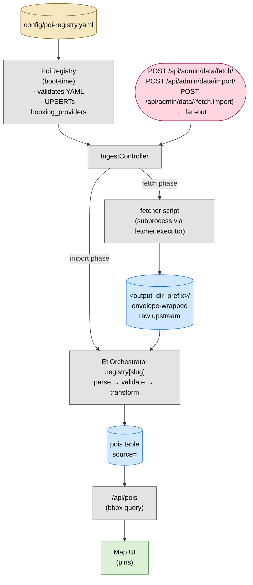

# Adding a data source

The pipeline is config-driven. `config/poi-registry.yaml` is the source of truth — adding a data source means adding one YAML row first, then filling in the code the YAML points at. Each step ends with a verification command. Run it before moving on.

## Pipeline at a glance




What flows where:

1. **YAML** — declares each data source's slug, fetcher script, ETL adapter, category, args, output dir. Backend reads it at boot and refuses to start if it's invalid.
2. **Fetch phase** — IngestController spawns a subprocess: `<fetcher.executor> <fetcher.filename> --<arg> <value> …`. The script writes envelope-wrapped raw bytes into the YAML's `output_dir_prefix` (typically `data/raw/<slug>/<UTC-ts>.json`, possibly a directory of pages). No DB writes.
3. **Import phase** — EtlOrchestrator looks up the registered Kotlin adapter by slug, parses the newest capture under that source's `output_dir_prefix`, validates, transforms to `Poi.*`, and `Upsert.run` writes/sweeps `pois` rows scoped to `source=<slug>`.
4. **Frontend** — `/api/pois` does a bbox PostGIS query against `pois`. No knowledge of sources or fetchers; it just renders whatever's in the table for the visible map area.

How runs are triggered:

- **One target, manual** — `POST /api/admin/data/fetch/<slug>` then `/import/<slug>`. The route returns a `run_id` and final status; full history in `ingest_runs`.
- **Fan-out** — `POST /api/admin/data/{fetch,import}` (no slug) walks every `enabled: true` data_source sequentially. Skips anything with `fetcher.enabled: false` for the fetch leg.
- **Local dev** — Tilt buttons + `make data-fetch` / `make data-import` curl the same admin endpoints.
- **Recurring** — currently none; runs are triggered manually until a cron/worker lands.

## Conventions

- `<slug>` — kebab-case identifier you pick. Same string everywhere: YAML, fetcher output dir, `sourceName` in the ETL, `EtlOrchestrator.registry` key.
- `<Vendor>` — PascalCase, used for the Kotlin package and class.
- `<category>` — match an existing FE-recognized category. New categories require a separate change.
- All commands assume cwd = repo root, backend running on `127.0.0.1:8765`.

## Step 1 — Add the YAML row

This is the contract. Everything else fulfills it.

**Edit** `config/poi-registry.yaml`. Append under `data_sources:`:

```yaml
- slug: <slug>
  name: <human-readable name>
  enabled: true
  category: <category>
  legend_bucket: <bucket>         # required for some categories; check existing rows
  fetcher:
    executor: <runtime>           # e.g. python3, node, bun, /usr/bin/env bash — anything on PATH
    filename: <path/to/fetcher>   # repo-relative; passed as the executor's first argument
    args: {}                      # optional; flattened to --key value at runtime
    output_dir_prefix: <path>     # repo-relative dir for raw envelopes; convention: data/raw/<slug>
    enabled: true                 # set false to keep imports running when upstream is unreachable
  etl_adapter: <Vendor>Etl
  data_provider:                  # optional; only if upstream is also a booking platform
    vendor: <vendor-id>
    host: <hostname>
    name: <Vendor>
    adapter: ""                   # leave empty until an availability adapter ships
  depends_on: []                  # optional; slugs that must run before this one
```

The other steps just create the things this row references — fetcher script, Kotlin class, env var.

**Verify** the YAML parses cleanly. Restart the backend (or `docker compose restart backend`) and watch logs:

```bash
docker compose logs -f backend | grep -E "PoiRegistry|registry"
```

The backend will refuse to boot if the YAML has duplicate slugs, dangling `depends_on`, or a `data_provider` deletion that orphans an existing FK. At this point you'll see one of two things:

- Clean boot, but `no ETL registered for source=<slug>` warnings the moment you try to import. That's expected — the registry doesn't have the entry yet.
- Boot fails with a validation error → fix the YAML before continuing.

## Step 2 — Fetcher script

Create what `fetcher.filename` points at. The runtime is whatever you put in `fetcher.executor` — Python, Node/Bun, shell, a compiled binary already on PATH. The IngestController invokes it as:

```
<fetcher.executor> <fetcher.filename> --<arg-1> <value-1> --<arg-2> <value-2> …
```

so the script must accept the `args:` keys as `--<key> <value>` flags. Whatever varies per tenant must surface there, not as a hard-coded constant in the script.

Required, regardless of language: write envelope-wrapped raw bytes into `fetcher.output_dir_prefix` (the value from the YAML row). The envelope shape is the contract — read the existing fetchers under `scripts/` for the canonical layout (a small helper module already exists for the most-common runtime; mirror its output if you're using a different language).

### Auth — API keys, tokens, cookies

If the upstream needs a secret, **read it from an env var inside the fetcher; never hard-code or commit it.**

1. Pick an env-var name. Use the upstream's natural name plus a unique suffix when needed.
2. **Read it in the fetcher** using whatever the runtime's env-var API is. When the variable is missing or empty, log a clear stderr error and exit non-zero — the IngestController records `exit_code != 0` as a failed fetch, which is better than running and capturing garbage.
3. **Document it in `.env.example`** at the repo root with a one-line "where to get it" comment. Local dev copies `.env.example → .env` and fills it in. `.env` is gitignored.
4. **Plumb it to the runtime that runs the fetcher:**

  | Runtime                      | How to inject                                                                                                                              |
  | ---------------------------- | ------------------------------------------------------------------------------------------------------------------------------------------ |
  | Tilt (local dev)             | Add `'<VAR>': DOTENV.get('<VAR>', '')` to the Tilt resource's `serve_env`                                                                  |
  | docker compose (deploy host) | Add `- <VAR>=${<VAR>}` under the `backend` service's `environment:` in `docker-compose.yml`, and set `<VAR>=…` in the deploy host's `.env` |
  | Bare invocation              | Have the var exported in the shell or in a sourced env file before the run                                                                 |

5. **For rotating secrets** (cookies, short-TTL tokens) reuse the existing refresh-script pattern under `scripts/` if your upstream has the same shape.

**Never** commit a real key. **Never** log the key value. Don't include it in the envelope's `request_headers`.

**Verify** the raw envelope lands on disk by invoking the fetcher directly with the same command the IngestController would build:

```bash
<fetcher.executor> <fetcher.filename> --<arg-1> <value-1> …
ls <fetcher.output_dir_prefix>/
```

You should see one or more `*.json` files. Open the newest one and spot-check that:

- `fetcher` matches the script's identifier
- `response.status` is `200` (or whatever success looks like for this upstream)
- `payload` is the verbatim upstream body

If status isn't right, fix the fetcher before continuing.

## Step 3 — Kotlin ETL adapter

Create what `etl_adapter:` points at: `backend/src/main/kotlin/ca/floo/roadtrip/etl/<vendor>/<Vendor>Etl.kt`. Implement `SourceEtl<DTO, Poi.<Subtype>>`:

- `sourceName` returns the YAML slug — must match exactly.
- `multiPart = true` if the fetcher writes a directory of `page-NNN.json` files. Default `false` is one envelope per run.
- `parse(envelope) → DTO` (or `parseMulti(List<Envelope>) → DTO`).
- `validate(dto) → ValidationResult` for required-field/well-formedness checks.
- `transform(dto, ctx) → List<Poi.Subtype>`. Use `ctx.governingBodyId(...)`, `ctx.bookingProviderId(...)`, and `ctx.legendBucketFor(sourceName)` for FK + bucket lookups.

Read existing ETLs under `backend/src/main/kotlin/ca/floo/roadtrip/etl/` for the closest pattern.

Test fixtures live at `backend/src/test/resources/etl-fixtures/<slug>/`. Add a parse + transform test at `backend/src/test/kotlin/ca/floo/roadtrip/etl/<vendor>/<Vendor>EtlTest.kt`.

**Verify** the adapter compiles and tests pass:

```bash
cd backend && ./gradlew compileKotlin compileTestKotlin
./gradlew test --tests "ca.floo.roadtrip.etl.<vendor>.*"
```

## Step 4 — Register the adapter

**Edit** `backend/src/main/kotlin/ca/floo/roadtrip/etl/EtlOrchestrator.kt`. Add one line to the `registry` map. The map key MUST equal the YAML `<slug>`.

```kotlin
val registry: Map<String, SourceEtl<*, *>> =
    mapOf(
        ...,
        "<slug>" to ca.floo.roadtrip.etl.<vendor>.<Vendor>Etl(),
    )
```

**Verify** the registry compiles and the backend boots clean:

```bash
cd backend && ./gradlew compileKotlin
docker compose restart backend
docker compose logs --tail=50 backend | grep -i "registry\|warn"
```

No warning about a missing adapter for `<slug>`.

## Step 5 — Trigger fetch + import end-to-end

**Run fetch + import via the admin API:**

```bash
# Fetch raw data (writes <fetcher.output_dir_prefix>/<ts>.json)
curl -X POST http://127.0.0.1:8765/api/admin/data/fetch/<slug>

# Import raw → Postgres pois
curl -X POST http://127.0.0.1:8765/api/admin/data/import/<slug>
```

Each call returns `{"run_id": …, "status": "completed"}`. Status `failed` means check `ingest_runs`:

```bash
docker exec roadtrip-postgres-1 psql -U roadtrip -d roadtrip -c \
  "SELECT id, phase, status, exit_code, counts, notes
   FROM ingest_runs WHERE target='<slug>' ORDER BY started_at DESC LIMIT 5;"
```

Look for `counts.seen` (rows transformed), `counts.swept` (deletions from prior run), and `notes` on failures.

**Verify rows landed in `pois`:**

```bash
docker exec roadtrip-postgres-1 psql -U roadtrip -d roadtrip -c \
  "SELECT category, source, COUNT(*) FROM pois
   WHERE source='<slug>' AND deleted_at IS NULL
   GROUP BY 1,2;"
```

Expect a single row with the count matching `counts.seen` from the import. Spot-check a few:

```bash
docker exec roadtrip-postgres-1 psql -U roadtrip -d roadtrip -c \
  "SELECT name, category, ST_AsText(geom)
   FROM pois WHERE source='<slug>' AND deleted_at IS NULL LIMIT 5;"
```

Coordinates should look right for the region you're targeting.

**Verify pins render on the map:**

1. Open the app (`http://127.0.0.1:8765/`).
2. Pan + zoom into the region the data covers.
3. Toggle the matching legend filter for your `category`.
4. Click a pin — drawer opens with the name and meta you put in `transform()`.

If pins don't show: check the FE network tab for `/api/pois` POSTs. The response should include features with your `source` value. If they're there but no pins, your category isn't matched by any FE legend toggle — pick a different category in the YAML, or add a new one (out of scope for onboarding).

## One fetcher, many data sources

Many upstreams are a single platform with multiple tenants. Don't write one fetcher per tenant. Write one fetcher, parameterized by `args:` in the YAML, and add one `data_sources` row per tenant.

### What this looks like

**One fetcher script** takes CLI flags for whatever varies per tenant. Each `data_source` row points at the same `executor` + `filename` but passes different `args:`. Each row gets its own raw directory because `output_dir_prefix` is per-row.

**One Kotlin ETL class** registered N times in `EtlOrchestrator.registry`, each entry passing the corresponding slug to the constructor. The class accepts the slug as a constructor arg and returns it from `sourceName`. Same parser, same transformer; the slug just labels the rows.

### Adding a new tenant under an existing fetcher

Two-line change:

1. Append a `data_sources:` row in `config/poi-registry.yaml` with new `slug`, `args:`, `output_dir_prefix:`, and the existing `etl_adapter:` name.
2. Add one line to `EtlOrchestrator.registry` mapping the new slug to a fresh ETL instance: `"<new-slug>" to <Existing>Etl("<new-slug>")`.

No new fetcher script. No new Kotlin class. No DB migration.

### Designing a new fetcher for multi-tenant from day one

1. **Make the fetcher take a CLI flag** for whatever varies. Surface it via `args:` in the YAML; the value participates in `output_dir_prefix` so each tenant lands in its own raw dir.
2. **Make the ETL class take the slug as a constructor arg.** Don't hard-code the slug as a constant — the same class will be instantiated multiple times with different slugs.
3. **Use `TransformCtx.legendBucketFor(slug)`** (and similar context helpers) for any per-tenant metadata. The YAML is the source of truth.
4. **First YAML row** verifies the wiring works for one tenant. Adding the second tenant should require zero new code.

### Verify

After adding a second tenant under an existing fetcher:

```bash
# Per-tenant raw lands in its own dir (the new row's fetcher.output_dir_prefix)
curl -X POST http://127.0.0.1:8765/api/admin/data/fetch/<new-slug>
ls <new-row's fetcher.output_dir_prefix>/

# Per-tenant import keys off the slug
curl -X POST http://127.0.0.1:8765/api/admin/data/import/<new-slug>
docker exec roadtrip-postgres-1 psql -U roadtrip -d roadtrip -c \
  "SELECT source, COUNT(*) FROM pois
   WHERE source IN ('<existing-slug>', '<new-slug>') AND deleted_at IS NULL
   GROUP BY 1;"
```

You should see two rows, each with its own count. **Existing tenants must not lose rows when the new tenant imports** — the `Upsert` sweep is scoped to `WHERE source = '<importing-slug>'`, so cross-source bleed is impossible if the slug is set correctly. Confirm by importing the new slug and re-checking the existing slug's count.

## Quick reference


| What                     | Where                                                                                                   |
| ------------------------ | ------------------------------------------------------------------------------------------------------- |
| Register source          | `config/poi-registry.yaml` `data_sources:` (start here)                                                 |
| New fetcher              | `scripts/<fetcher>` (any runtime — `fetcher.executor` in YAML decides)                                  |
| New ETL                  | `backend/src/main/kotlin/ca/floo/roadtrip/etl/<vendor>/<Vendor>Etl.kt`                                  |
| ETL test                 | `backend/src/test/kotlin/.../<vendor>/<Vendor>EtlTest.kt`                                               |
| Test fixtures            | `backend/src/test/resources/etl-fixtures/<slug>/`                                                       |
| Register adapter         | `EtlOrchestrator.kt` `registry` map                                                                     |
| Trigger fetch            | `POST /api/admin/data/fetch/<slug>`                                                                     |
| Trigger import           | `POST /api/admin/data/import/<slug>`                                                                    |
| Run history              | `GET /api/admin/data/runs?target=<slug>`                                                                |
| Health snapshot          | `GET /api/admin/data/health`                                                                            |
| Add an env var           | `.env.example` (template) + `.env` (real value, gitignored) + Tilt `serve_env` + compose `environment:` |
| Same fetcher, new tenant | New `data_sources:` row + new `EtlOrchestrator.registry` line. No new fetcher or Kotlin files.          |


## Troubleshooting


| Symptom                                                | First thing to check                                                                                                                                                                                      |
| ------------------------------------------------------ | --------------------------------------------------------------------------------------------------------------------------------------------------------------------------------------------------------- |
| `FileNotFoundException` at backend boot                | `config/poi-registry.yaml` is mounted at `/app/static/config/` (see `docker-compose.yml`).                                                                                                                |
| `validation error: data_source slug='…'` at boot       | Duplicate slug or unresolved `depends_on`. Fix the YAML.                                                                                                                                                  |
| `no ETL registered for source=<slug>` on import        | `EtlOrchestrator.registry` doesn't have the slug. Map key must match.                                                                                                                                     |
| Import returns `status: completed` but `counts.seen=0` | `parse()` or `validate()` is dropping rows. Add a unit test against a real raw envelope.                                                                                                                  |
| Pins missing despite `pois` rows present               | Wrong `category` for the FE legend toggle, or `geom` is null.                                                                                                                                             |
| Fetch returns 403 / WAF challenge                      | Add browser-shaped UA + `Referer`; some upstreams need a primed cookie jar.                                                                                                                               |
| `concurrent same-target` error                         | Another run is already in flight. `GET /api/admin/data/runs?target=<slug>` to see it.                                                                                                                     |
| Fetch fails with `<VAR> env var not set`               | The runtime didn't pass the secret through. Check Tilt `serve_env` (local), `docker-compose.yml` `environment:` (deploy), and that the value is actually set in `.env`.                                   |
| Two tenants of one fetcher overwrite each other's rows | Each `data_source` must use a unique `slug` AND its ETL registration must pass that slug into the class constructor (`<Existing>Etl("<slug>")`). The Upsert's per-source sweep is scoped to `sourceName`. |
| One tenant's import wipes another's POIs               | Same fix as above — confirm `sourceName` differs across the two `EtlOrchestrator.registry` entries.                                                                                                       |


