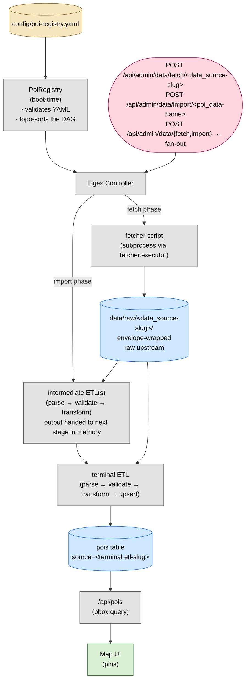

# Adding a data source

The pipeline is config-driven. `config/poi-registry.yaml` is the source of truth — adding a data source means adding YAML rows first, then filling in the code the YAML points at. Each step ends with a verification command. Run it before moving on.

## Pipeline at a glance



What flows where:

1. **YAML** has two sections. `data_sources:` declares fetchers (one row per upstream feed). `poi_data:` declares the user-facing datasets — each row carries `name`, `category`, optional `subcategory`, and an ordered `etls:` list. The **last** entry in `etls:` is the POI emitter (must output `Poi.*`); earlier entries are intermediates. Backend reads the YAML at boot, topo-sorts the DAG, and refuses to start if anything is wrong (duplicate slug, dangling `inputs:`, cycle, forward reference within `etls:`, cross-row etl ref, or the last `etls:` entry's adapter doesn't emit `Poi.*`).
2. **Fetch phase** — IngestController spawns a subprocess per `data_sources:` row: `<fetcher.executor> <fetcher.filename> --<arg> <value> …`. The script writes envelope-wrapped raw bytes into the YAML's `output_dir_prefix:` (typically `data/raw/<data_source-slug>/<UTC-ts>.json`, possibly a directory of pages). No DB writes.
3. **Import phase** — for each `poi_data:` row, the orchestrator runs the chain in declared order: each non-terminal `etls:` entry parses its `inputs:` (data_sources → `data/raw/`, prior siblings → typed payload from this same run) and produces a typed `JsonElement` that's handed to the next stage **in memory**. Re-running the import recomputes; intermediates don't persist. The last `etls:` entry parses its inputs the same way and runs `Upsert.run`, which writes/sweeps `pois` rows scoped to `source=<last etl-slug>`.
4. **Frontend** — `/api/pois` does a bbox PostGIS query against `pois`. No knowledge of sources, fetchers, or ETLs; it just renders whatever's in the table for the visible map area.

How runs are triggered:

- **One target, manual** — fetch and import are addressed differently. Fetch is per data_source: `POST /api/admin/data/fetch/<data_source-slug>`. Import is per poi_data row: `POST /api/admin/data/import/<poi_data-name>`. Both return a `run_id` and final status; full history in `ingest_runs`.
- **Fan-out** — `POST /api/admin/data/fetch` (no slug) walks every `data_sources:` row sequentially. `POST /api/admin/data/import` walks every `poi_data:` row whose `enabled:` is true (default). A target whose fetcher is unreachable is recorded as a failed run and the next target proceeds; the import phase doesn't depend on the fetch phase.
- **Local dev** — Tilt buttons + `make data-fetch` / `make data-import` curl the same admin endpoints.
- **Recurring** — currently none; runs are triggered manually until a cron/worker lands.

## Conventions

- `<data_source-slug>` and `<etl-slug>` — kebab-case identifiers you pick. Each must be unique across the whole YAML; data_sources and ETLs share a single namespace because `inputs:` resolves a slug into either kind.
- `<Vendor>` — PascalCase, used for the Kotlin package and class.
- `<category>` — match an existing FE-recognized category. New categories require a separate change.
- `<subcategory>` — drives the FE legend toggles + circle-color expression for that category. Required when the category has multiple sub-buckets (e.g. `campground` ⇒ `federal | state | local | provincial | private`); omitted when a category has no sub-bucket (`planet-fitness`, `supercharger`).
- `inputs:` are dependency edges. Within a row's `etls:` list, list order is dependency order — entry N may only reference data_source slugs OR earlier siblings (index < N). The last entry is the emitter. There is no separate `depends_on:` field.
- All commands assume cwd = repo root, backend running on `127.0.0.1:8765`.

## When to add what

The shape of your data dictates how many YAML rows you write:

- **One upstream → one POI dataset.** Add one `data_sources:` row + one `poi_data:` row whose `etls:` list contains a single entry that reads that fetcher and emits `Poi.*`.
- **Multiple upstreams join into one POI dataset.** Add one `data_sources:` row per upstream + one `poi_data:` row whose single `etls:` entry reads them all and emits `Poi.*`.
- **Same upstream, multiple stages of transform before emit.** Add the fetcher + a `poi_data:` row with an `etls:` list of length ≥ 2: earlier entries materialize intermediates, the last entry emits.
- **Same fetcher used by multiple POI datasets** (same script, different tenants). Add one `data_sources:` row per tenant (each with different `args:` and `output_dir_prefix:`); the same Kotlin ETL class can be referenced from multiple `poi_data:` rows.
- **Same intermediate consumed by multiple POI datasets.** Today: duplicate the entry in each row's `etls:` list. If sharing becomes routine, we'll promote intermediates to a top-level section.

## Step 1 — Add the YAML rows

This is the contract. Everything else fulfills it.

**Edit** `config/poi-registry.yaml`. Append a new `data_sources:` row for each upstream feed:

```yaml
data_sources:
  - slug: <data_source-slug>
    name: <human-readable name>
    fetcher:
      executor: <runtime>           # e.g. python3, node, bun, /usr/bin/env bash — anything on PATH
      filename: <path/to/fetcher>   # repo-relative; passed as the executor's first argument
      args: {}                      # optional; flattened to --key value at runtime
      output_dir_prefix: <path>     # repo-relative dir for raw envelopes; convention: data/raw/<data_source-slug>
```

Then append a `poi_data:` row for the dataset that consumes those fetchers. The `etls:` list is ordered: each entry depends only on data_sources or earlier siblings. The **last entry is the emitter** — its adapter's output type must be `Poi.*`.

```yaml
poi_data:
  - name: <Human-Readable Dataset Name>
    enabled: true                   # default true; set false to skip in fan-out import
    category: <category>
    subcategory: <subcategory>      # required for categories with sub-buckets
    etls:
      # First entry: intermediate (only present if you need staging).
      # Output is handed to the next stage in memory — no on-disk file.
      - slug: <intermediate-etl-slug>
        adapter: <Vendor>StageEtl
        inputs: [<data_source-slug>, <other-data_source-slug>]
      # Last entry: emitter (must produce Poi.*)
      - slug: <terminal-etl-slug>
        adapter: <Vendor>Etl
        inputs: [<intermediate-etl-slug>, <data_source-slug>]
        args: {}                    # optional; transformer-specific (e.g. host, state_filter)
```

Single-stage row (no intermediates):

```yaml
- name: <Simple Dataset>
  category: <category>
  etls:
    - slug: <terminal-etl-slug>
      adapter: <Vendor>Etl
      inputs: [<data_source-slug>]
```

The other steps just create the things these rows reference — fetcher scripts, Kotlin classes, env vars.

**Verify** the YAML parses cleanly and the DAG is valid. Restart the backend (or `docker compose restart backend`) and watch logs:

```bash
docker compose logs -f backend | grep -E "PoiRegistry|registry"
```

The backend will refuse to boot if the YAML has duplicate slugs, dangling `inputs:`, an `etls:` entry that depends on a later sibling, a cycle, or a row's last `etls:` adapter whose declared output type isn't `Poi.*`. At this point you'll see one of two things:

- Clean boot, but `no adapter registered for slug=<…>` warnings the moment you try to import. That's expected — the Kotlin registry doesn't have the entry yet.
- Boot fails with a validation error → fix the YAML before continuing.

## Step 2 — Fetcher script(s)

Create what each `data_sources:` row's `fetcher.filename` points at. The runtime is whatever you put in `fetcher.executor` — Python, Node/Bun, shell, a compiled binary already on PATH. The IngestController invokes it as:

```
<fetcher.executor> <fetcher.filename> --<arg-1> <value-1> --<arg-2> <value-2> …
```

so the script must accept the `args:` keys as `--<key> <value>` flags. Whatever varies per tenant must surface there, not as a hard-coded constant in the script.

Required, regardless of language: write envelope-wrapped raw bytes into `fetcher.output_dir_prefix:` (the value from the YAML row). The envelope shape is the contract — read the existing fetchers under `scripts/` for the canonical layout (a small helper module already exists for the most-common runtime; mirror its output if you're using a different language).

### Auth — API keys, tokens, cookies

If the upstream needs a secret, **read it from an env var inside the fetcher; never hard-code or commit it.**

1. Pick an env-var name. Use the upstream's natural name plus a unique suffix when needed.
2. **Read it in the fetcher** using whatever the runtime's env-var API is. When the variable is missing or empty, log a clear stderr error and exit non-zero — the IngestController records `exit_code != 0` as a failed fetch, which is better than running and capturing garbage.
3. **Document it in `.env.example`** at the repo root with a one-line "where to get it" comment. Local dev copies `.env.example → .env` and fills it in. `.env` is gitignored.
4. **Plumb it to the runtime that runs the fetcher:**

  | Runtime                      | How to inject                                                                                                                              |
  | ---------------------------- | ------------------------------------------------------------------------------------------------------------------------------------------ |
  | Tilt (local dev)             | Add `'<VAR>': DOTENV.get('<VAR>', '')` to the Tilt resource's `serve_env`                                                                  |
  | docker compose (deploy host) | Add `- <VAR>=${<VAR>}` under the `backend` service's `environment:` in `docker-compose.yml`, and set `<VAR>=…` in the deploy host's `.env` |
  | Bare invocation              | Have the var exported in the shell or in a sourced env file before the run                                                                 |

5. **For rotating secrets** (cookies, short-TTL tokens) reuse the existing refresh-script pattern under `scripts/` if your upstream has the same shape.

**Never** commit a real key. **Never** log the key value. Don't include it in the envelope's `request_headers`.

**Verify** the raw envelope lands on disk by invoking the fetcher directly with the same command the IngestController would build:

```bash
<fetcher.executor> <fetcher.filename> --<arg-1> <value-1> …
ls <fetcher.output_dir_prefix>/
```

You should see one or more `*.json` files. Open the newest one and spot-check that:

- `fetcher` matches the script's identifier
- `response.status` is `200` (or whatever success looks like for this upstream)
- `payload` is the verbatim upstream body

If status isn't right, fix the fetcher before continuing.

## Step 3 — Kotlin ETL adapter(s)

For each `etls:` entry in your `poi_data:` row, create what its `adapter:` field points at: `backend/src/main/kotlin/ca/floo/roadtrip/etl/<vendor>/<Vendor>Etl.kt`. Implement `SourceEtl<INPUTS, OUT>`:

- `etlSlug` returns the YAML slug — must match exactly.
- `inputs` returns the list of `data_source-slug` and `etl-slug` strings the YAML declared (the framework reads these for you; you implement `parse()` against an `InputBundle` it hands you).
- `multiPart = true` if any of the input data_sources writes a directory of `page-NNN.json` files. Default `false` is one envelope per run.
- `parse(bundle) → INPUTS` (or `parseMulti(...)` for multipart). `bundle` exposes one accessor per declared input slug, returning either `List<Envelope>` (data_source) or the typed payload from a prior etl.
- `validate(inputs) → ValidationResult` for required-field/well-formedness checks.
- `transform(inputs, ctx) → OUT`. For an intermediate, `OUT` is whatever `@Serializable` payload you want to hand to the next stage (the orchestrator passes it through `kotlinx.serialization` so siblings can read it as a `JsonElement`); nothing persists to disk. For the terminal (last) `etls:` entry, `OUT` is `List<Poi.*>`.

For terminal ETLs that need booking-provider context (Aspira, RecGov, etc.), use `ctx.bookingProviderId(vendor, host)` to resolve the FK and construct your `ProviderRef.<Vendor>(...)` payload directly. Booking provider is **not** in `poi-registry.yaml`; it's seeded once into the `booking_provider` table and the ETL hard-codes its `ProviderRef` variant.

For terminal ETLs that need the FE bucket, use `ctx.subcategoryFor(etlSlug)` to read the value the YAML declared on the owning `poi_data:` row.

Read existing ETLs under `backend/src/main/kotlin/ca/floo/roadtrip/etl/` for the closest pattern.

Test fixtures live at `backend/src/test/resources/etl-fixtures/<slug>/`. Add a parse + transform test at `backend/src/test/kotlin/ca/floo/roadtrip/etl/<vendor>/<Vendor>EtlTest.kt`.

**Verify** the adapter compiles and tests pass:

```bash
cd backend && ./gradlew compileKotlin compileTestKotlin
./gradlew test --tests "ca.floo.roadtrip.etl.<vendor>.*"
```

## Step 4 — Register the adapter(s)

**Edit** `backend/src/main/kotlin/ca/floo/roadtrip/etl/EtlOrchestrator.kt`. Add one line per `etls:` entry to the `registry` map. Map keys MUST equal the YAML `slug` of the corresponding ETL.

```kotlin
val registry: Map<String, SourceEtl<*, *>> =
    mapOf(
        ...,
        "<intermediate-etl-slug>" to ca.floo.roadtrip.etl.<vendor>.<Vendor>StageEtl(),
        "<terminal-etl-slug>"     to ca.floo.roadtrip.etl.<vendor>.<Vendor>Etl(),
    )
```

For ETL classes that take a slug as a constructor arg (one class instantiated per tenant), pass it explicitly:

```kotlin
"aspira-leaves-wa" to AspiraLeavesEtl("aspira-leaves-wa"),
"aspira-leaves-bc" to AspiraLeavesEtl("aspira-leaves-bc"),
```

**Verify** the registry compiles and the backend boots clean:

```bash
cd backend && ./gradlew compileKotlin
docker compose restart backend
docker compose logs --tail=50 backend | grep -i "registry\|warn"
```

No warning about a missing adapter for any of your slugs.

## Step 5 — Trigger fetch + import end-to-end

**Run fetch** (per data_source) **and import** (per poi_data row) via the admin API:

```bash
# Fetch raw data — one call per data_source
curl -X POST http://127.0.0.1:8765/api/admin/data/fetch/<data_source-slug>

# Import: walks the row's etls: list in order, materializes each intermediate,
# then the terminal etl runs and upserts.
curl -X POST "http://127.0.0.1:8765/api/admin/data/import/$(echo '<Poi Data Name>' | jq -sRr @uri)"
```

Each call returns `{"run_id": …, "status": "completed"}`. Status `failed` means check `ingest_runs`:

```bash
docker exec roadtrip-postgres-1 psql -U roadtrip -d roadtrip -c \
  "SELECT id, target, phase, status, exit_code, counts, notes
   FROM ingest_runs WHERE target IN ('<data_source-slug>', '<terminal-etl-slug>') ORDER BY started_at DESC LIMIT 10;"
```

Look for `counts.seen` (rows transformed), `counts.swept` (deletions from prior run), and `notes` on failures.

**Verify rows landed in `pois`:**

```bash
docker exec roadtrip-postgres-1 psql -U roadtrip -d roadtrip -c \
  "SELECT category, source, COUNT(*) FROM pois
   WHERE source='<terminal-etl-slug>' AND deleted_at IS NULL
   GROUP BY 1,2;"
```

Expect a single row with the count matching `counts.seen` from the import. Spot-check a few:

```bash
docker exec roadtrip-postgres-1 psql -U roadtrip -d roadtrip -c \
  "SELECT name, category, ST_AsText(geom)
   FROM pois WHERE source='<terminal-etl-slug>' AND deleted_at IS NULL LIMIT 5;"
```

Coordinates should look right for the region you're targeting.

**Verify pins render on the map:**

1. Open the app (`http://127.0.0.1:8765/`).
2. Pan + zoom into the region the data covers.
3. Toggle the matching legend filter for your `category` + `subcategory`.
4. Click a pin — drawer opens with the name and meta you put in `transform()`.

If pins don't show: check the FE network tab for `/api/pois` POSTs. The response should include features with your `source` value (the terminal etl slug). If they're there but no pins, your category/subcategory isn't matched by any FE legend toggle — pick a different `category` + `subcategory` in the YAML, or add a new one (out of scope for onboarding).

## One fetcher, many tenants

Many upstreams are a single platform with multiple tenants. Don't write one fetcher per tenant. Write one fetcher, parameterized by `args:` in the YAML, and add one `data_sources:` row per tenant.

### What this looks like

**One fetcher script** takes CLI flags for whatever varies per tenant. Each `data_sources:` row points at the same `executor:` + `filename:` but passes different `args:`. Each row gets its own raw directory because `output_dir_prefix:` is per-row.

**One Kotlin ETL class** registered N times in `EtlOrchestrator.registry`, each entry passing the corresponding slug to the constructor. The class accepts the slug as a constructor arg and returns it from `etlSlug`. Same parser, same transformer; the slug just labels the rows.

### Adding a new tenant under an existing fetcher

1. Append a `data_sources:` row in `config/poi-registry.yaml` with new `slug`, `args:`, and `output_dir_prefix:`.
2. Append a `poi_data:` row that consumes it. The terminal `etls:` slug is the new tenant identifier; `args:` carries per-tenant config (e.g. `host`).
3. Add one line to `EtlOrchestrator.registry` mapping the new terminal etl slug (and any new intermediates) to fresh ETL instances: `"<new-slug>" to <Existing>Etl("<new-slug>")`.

No new fetcher script. No new Kotlin class. No DB migration.

### Designing a new fetcher for multi-tenant from day one

1. **Make the fetcher take a CLI flag** for whatever varies. Surface it via `args:` in the YAML; the value participates in `output_dir_prefix:` so each tenant lands in its own raw dir.
2. **Make the ETL class take the slug as a constructor arg.** Don't hard-code the slug as a constant — the same class will be instantiated multiple times with different slugs.
3. **Use `TransformCtx` helpers** for any per-tenant metadata. `subcategoryFor(etlSlug)` reads the YAML; `bookingProviderId(vendor, host)` resolves the FK from `args.host`.
4. **First `poi_data:` row** verifies the wiring works for one tenant. Adding the second tenant should require zero new code — only YAML + one `EtlOrchestrator.registry` line.

### Verify

After adding a second tenant:

```bash
# Per-tenant raw lands in its own dir
curl -X POST http://127.0.0.1:8765/api/admin/data/fetch/<new-data_source-slug>
ls <new data_source's fetcher.output_dir_prefix>/

# Per-tenant import keys off the terminal etl slug
curl -X POST http://127.0.0.1:8765/api/admin/data/import/<new-poi_data-name>
docker exec roadtrip-postgres-1 psql -U roadtrip -d roadtrip -c \
  "SELECT source, COUNT(*) FROM pois
   WHERE source IN ('<existing-terminal-etl-slug>', '<new-terminal-etl-slug>') AND deleted_at IS NULL
   GROUP BY 1;"
```

You should see two rows, each with its own count. **Existing tenants must not lose rows when the new tenant imports** — `Upsert`'s sweep is scoped to `WHERE source = '<importing terminal-etl slug>'`, so cross-source bleed is impossible if the slugs are set correctly.

## Multi-stage pipelines: when to add an intermediate

Use a non-terminal `etls:` entry when one of these is true:

- **The fetched payload needs heavy normalization before it can be joined.** E.g. Aspira's `/api/maps` returns a tree of pixel-coord image maps; an intermediate walks the tree to produce a flat list of `(name, transactionLocationId, mapId, resourceLocationId)` leaves. Downstream ETLs read the flat list, not the tree.
- **Two upstreams need to be unified into one logical input** before the terminal join. E.g. Parks Canada geometry comes from two ArcGIS layers (per-campground points + per-park polygon centroids); an intermediate unifies them into `(name → lat/lng)` so the terminal join is single-source for geometry.
- **The transform is expensive enough that you want to inspect the result on disk** without re-running the whole chain.

Don't add an intermediate when:

- **The whole transform fits in one `transform()` method.** Inlining is simpler.
- **You want it just for testing.** ETL test fixtures handle that without a YAML row.

### Verify intermediates work

The orchestrator hands intermediate output between sibling stages **in
memory** — nothing persists to disk. To verify the chain end-to-end, run
the import and check:

```bash
curl -X POST "http://127.0.0.1:8765/api/admin/data/import/<poi_data-name>"
docker exec roadtrip-postgres-1 psql -U roadtrip -d roadtrip -c \
  "SELECT id, target, status, counts FROM ingest_runs
   WHERE target = '<poi_data-name>' ORDER BY id DESC LIMIT 1;"
```

`counts.seen` should be the number of `Poi.*` rows the terminal etl
emitted. If it's lower than expected, the intermediate's `transform()`
likely dropped rows; add a unit test for the intermediate against a
fixture envelope to pin down the regression.

## Quick reference

| What                                | Where                                                                                                   |
| ----------------------------------- | ------------------------------------------------------------------------------------------------------- |
| Register fetcher                    | `config/poi-registry.yaml` `data_sources:`                                                              |
| Register POI dataset                | `config/poi-registry.yaml` `poi_data:` (`name`, `category`, `subcategory`, `etls:` ordered list)        |
| New fetcher script                  | `scripts/<fetcher>` (any runtime — `fetcher.executor` decides)                                          |
| New ETL                             | `backend/src/main/kotlin/ca/floo/roadtrip/etl/<vendor>/<Vendor>Etl.kt`                                  |
| ETL test                            | `backend/src/test/kotlin/.../<vendor>/<Vendor>EtlTest.kt`                                               |
| Test fixtures                       | `backend/src/test/resources/etl-fixtures/<slug>/`                                                       |
| Register adapter                    | `EtlOrchestrator.kt` `registry` map (one line per ETL slug, intermediates included)                    |
| Trigger fetch                       | `POST /api/admin/data/fetch/<data_source-slug>`                                                         |
| Trigger import                      | `POST /api/admin/data/import/<poi_data-name>`                                                           |
| Run history                         | `GET /api/admin/data/runs?target=<slug>`                                                                |
| Data status snapshot                | `GET /api/admin/data/status`                                                                            |
| Add an env var                      | `.env.example` + `.env` + Tilt `serve_env` + compose `environment:`                                     |
| Same fetcher, new tenant            | New `data_sources:` + new `poi_data:` row + new `EtlOrchestrator.registry` line. No new fetcher.        |
| New intermediate stage              | Append a non-terminal entry to `etls:` (in dependency order) + register the adapter.                    |

## Troubleshooting

| Symptom                                                      | First thing to check                                                                                                                                                                                      |
| ------------------------------------------------------------ | --------------------------------------------------------------------------------------------------------------------------------------------------------------------------------------------------------- |
| `FileNotFoundException` at backend boot                      | `config/poi-registry.yaml` is mounted at `/app/static/config/` (see `docker-compose.yml`).                                                                                                                |
| `validation error: slug='…' duplicated` at boot              | Same slug used twice across `data_sources:` and any row's `etls:`. Slugs share one namespace — pick distinct names.                                                                                       |
| `validation error: forward reference in etls` at boot        | An entry in a row's `etls:` list declares an `inputs:` slug from a later sibling. Reorder so dependencies come first.                                                                                     |
| `validation error: cross-row refs not supported` at boot     | A row's `etls:` `inputs:` references an etl slug from a different `poi_data:` row. Intermediates are handed in memory within a row only; copy the upstream chain into this row, or promote it to a shared data_source. |
| `validation error: cycle detected in DAG` at boot            | Two ETLs reference each other through `inputs:`. Break the cycle.                                                                                                                                         |
| `validation error: last etls entry must emit Poi.*`          | The last entry's adapter must declare `OUT = List<Poi.*>`. Earlier entries can be any type.                                                                                                               |
| `no adapter registered for slug=<…>` on import               | `EtlOrchestrator.registry` doesn't have the slug. Map key must match the YAML slug exactly.                                                                                                               |
| Import returns `status: completed` but `counts.seen=0`       | An ETL's `parse()` or `validate()` is dropping rows. Add a unit test against a captured raw envelope under `backend/src/test/resources/etl-fixtures/<slug>/` to bisect which stage zeroes out.            |
| Intermediate ran but the terminal can't read it              | Mismatched payload type. The downstream `parse(bundle)` must match the upstream's emitted shape — keep the intermediate's `OUT` type and the terminal's expected input in sync.                           |
| Pins missing despite `pois` rows present                     | Wrong `category`/`subcategory` for the FE legend toggle, or `geom` is null.                                                                                                                               |
| Fetch returns 403 / WAF challenge                            | Add browser-shaped UA + `Referer`; some upstreams need a primed cookie jar.                                                                                                                               |
| `concurrent same-target` error                               | Another run is already in flight. `GET /api/admin/data/runs?target=<slug>` to see it.                                                                                                                     |
| Fetch fails with `<VAR> env var not set`                     | The runtime didn't pass the secret through. Check Tilt `serve_env` (local), `docker-compose.yml` `environment:` (deploy), and that the value is set in `.env`.                                            |
| Two tenants of one fetcher overwrite each other's `pois`     | Each `poi_data:` row's terminal etl slug must be unique AND the registered ETL instance must pass that slug into the class constructor. The Upsert sweep is scoped to the etl slug.                       |
| One tenant's import wipes another's POIs                     | Same fix as above — confirm the terminal etl slugs differ between rows AND the `EtlOrchestrator.registry` entries pass the right slug into each constructor.                                              |
