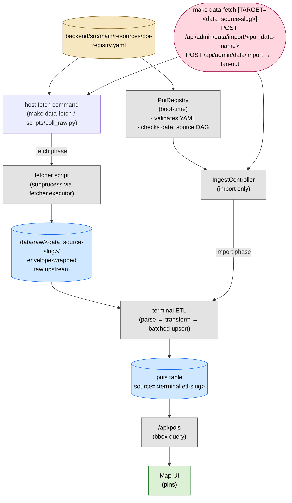

# Adding a data source

The pipeline is config-driven. `backend/src/main/resources/poi-registry.yaml` is the source of truth — adding a data source means adding YAML rows first, then filling in the code the YAML points at. Each step ends with a verification command. Run it before moving on.

## Pipeline at a glance


```mermaid
flowchart TB
    YAML[("backend/src/main/resources/poi-registry.yaml")]
    Registry["PoiRegistry<br/>(boot-time)<br/>· validates YAML<br/>· checks data_source DAG"]
    FetchCtl["host fetch command<br/>(make data-fetch / scripts/poll_raw.py)"]
    Ingest["IngestController<br/>(import only)"]
    Fetcher["fetcher script<br/>(subprocess via fetcher.executor)"]
    Raw[("data/raw/&lt;data_source-slug&gt;/<br/>envelope-wrapped<br/>raw upstream")]
    Emit["terminal ETL<br/>(parse → transform → batched upsert)"]
    Pois[("pois table<br/>source=&lt;terminal etl-slug&gt;")]
    PoisAPI["/api/pois<br/>(bbox query)"]
    FE["Map UI<br/>(pins)"]

    Trigger(["make data-fetch [TARGET=&lt;data_source-slug&gt;]<br/>POST /api/admin/data/import/&lt;poi_data-name&gt;<br/>POST /api/admin/data/import  ← fan-out"])

    YAML --> Registry --> Ingest
    YAML --> FetchCtl
    Trigger --> FetchCtl
    Trigger --> Ingest
    FetchCtl -- fetch phase --> Fetcher --> Raw
    Raw --> Emit
    Ingest -- import phase --> Emit
    Emit --> Pois
    Pois --> PoisAPI --> FE

    classDef cfg fill:#f6e7c1,stroke:#8a6d2b,color:#000
    classDef store fill:#cfe8ff,stroke:#1f6feb,color:#000
    classDef code fill:#e3e3e3,stroke:#555,color:#000
    classDef trig fill:#ffd6e0,stroke:#a3174e,color:#000
    classDef ui fill:#dcf0d6,stroke:#2e7d32,color:#000
    class YAML cfg
    class Raw,Pois store
    class Registry,Ingest,Fetcher,Emit,PoisAPI code
    class Trigger trig
    class FE ui
```

What flows where:

1. **YAML** has three sections. `data_sources:` declares fetchers (one row per upstream feed). `poi_data:` declares user-facing POI datasets. `campsite_data:` declares campsite catalogs. Each import row carries exactly one terminal `etls:` entry whose `inputs:` reference only `data_sources:` slugs. Backend reads the YAML at boot and refuses to start if anything is wrong (duplicate slug, dangling `inputs:`, cycle, multi-entry ETL row, or an unwired terminal adapter).
2. **Fetch phase** — `make data-fetch` / `scripts/poll_raw.py` spawns a subprocess per `data_sources:` row on the host: `<fetcher.executor> <fetcher.filename> --<arg> <value> …`. The script writes envelope-wrapped raw bytes into the YAML's `output_dir_prefix:` (typically `data/raw/<data_source-slug>/<UTC-ts>.json`, possibly a directory of pages). No DB writes and no backend container runtime dependency.
3. **Import phase** — for each `poi_data:` or `campsite_data:` row, the orchestrator runs the single terminal ETL. `parse()` consumes the newest raw envelopes and yields `ParseResult.Ok/Bad`; `transform()` yields `TransformResult.Ok/Bad` upsert candidates. The orchestrator counts bad rows, buffers successful candidates, and flushes bounded batches through the owning repo. One import run wraps the whole ETL job.
4. **Frontend** — `/api/pois` does a bbox PostGIS query against `pois`. No knowledge of sources, fetchers, or ETLs; it just renders whatever's in the table for the visible map area.

How runs are triggered:

- **One target, manual** — fetch and import are addressed differently. Fetch is per data_source: `make data-fetch TARGET=<data_source-slug>`. Import is per registry row: `POST /api/admin/data/import/<row-name>`. Import calls return a `run_id` and final status; full history is in `ingest_runs`.
- **Fan-out** — `make data-fetch` walks every enabled `data_sources:` row sequentially. `POST /api/admin/data/import` walks every enabled import row sequentially. The import phase doesn't depend on a fresh fetch; it reads the newest raw capture already on disk.
- **Local dev** — Tilt buttons + `make data-fetch` / `make data-import` run the same host-fetch/backend-import split.
- **Recurring** — currently none; runs are triggered manually until a cron/worker lands.

## Conventions

- `<data_source-slug>` and `<etl-slug>` — kebab-case identifiers you pick. Each must be unique across the whole YAML; data_sources and ETLs share a single namespace.
- `<Vendor>` — PascalCase, used for the Kotlin package and class.
- `<category>` — match an existing FE-recognized category. New categories require a separate change.
- `<subcategory>` — drives the FE legend toggles + circle-color expression for that category. Required when the category has multiple sub-buckets (e.g. `campground` ⇒ `federal | state | local | provincial | private`); omitted when a category has no sub-bucket (`planet-fitness`, `supercharger`).
- `inputs:` are dependency edges from one terminal ETL to raw data. They may only reference `data_sources:` slugs. There is no separate `depends_on:` field for ETLs.
- Commands assume cwd = repo root. Import commands also assume the backend is running on `127.0.0.1:8765`.

## When to add what

The shape of your data dictates how many YAML rows you write:

- **One upstream → one POI dataset.** Add one `data_sources:` row + one `poi_data:` row whose `etls:` list contains a single entry that reads that fetcher and emits catalog upsert candidates.
- **Multiple upstreams join into one POI dataset.** Add one `data_sources:` row per upstream + one `poi_data:` row whose single `etls:` entry reads them all and emits catalog upsert candidates.
- **Same fetcher used by multiple POI datasets** (same script, different tenants). Add one `data_sources:` row per tenant (each with different `args:` and `output_dir_prefix:`); the same Kotlin ETL class can be referenced from multiple `poi_data:` rows.

## Step 1 — Add the YAML rows

This is the contract. Everything else fulfills it.

**Edit** `backend/src/main/resources/poi-registry.yaml`. Append a new `data_sources:` row for each upstream feed:

```yaml
data_sources:
  - slug: <data_source-slug>
    name: <human-readable name>
    fetcher:
      executor: <runtime>           # e.g. python3, node, bun, /usr/bin/env bash — anything on PATH
      filename: <path/to/fetcher>   # repo-relative; passed as the executor's first argument
      args: {}                      # optional; flattened to --key value at runtime
      output_dir_prefix: <path>     # repo-relative dir for raw envelopes; convention: data/raw/<data_source-slug>
```

Then append a `poi_data:` row for the dataset that consumes those fetchers. The `etls:` list must contain exactly one terminal entry. Its `inputs:` must be data_source slugs.

```yaml
poi_data:
  - name: <Human-Readable Dataset Name>
    enabled: true                   # default true; set false to skip in fan-out import
    category: <category>
    subcategory: <subcategory>      # required for categories with sub-buckets
    etls:
      - slug: <terminal-etl-slug>
        adapter: <Vendor>Etl
        inputs: [<data_source-slug>, <other-data_source-slug>]
        args: {}                    # optional; transformer-specific (e.g. host, state_filter)
```

The other steps just create the things these rows reference — fetcher scripts, Kotlin classes, env vars.

**Verify** the YAML parses cleanly and the DAG is valid. Restart the backend (or `docker compose restart backend`) and watch logs:

```bash
docker compose logs -f backend | grep -E "PoiRegistry|registry"
```

The backend will refuse to boot if the YAML has duplicate slugs, dangling `inputs:`, a row with zero or multiple ETLs, or a cycle. At this point you'll see one of two things:

- Clean boot, but `no adapter registered for slug=<…>` warnings the moment you try to import. That's expected — the Kotlin registry doesn't have the entry yet.
- Boot fails with a validation error → fix the YAML before continuing.

## Step 2 — Fetcher script(s)

Create what each `data_sources:` row's `fetcher.filename` points at. The runtime is whatever you put in `fetcher.executor` — Python, Node/Bun, shell, a compiled binary already on PATH. The IngestController invokes it as:

```
<fetcher.executor> <fetcher.filename> --<arg-1> <value-1> --<arg-2> <value-2> …
```

so the script must accept the `args:` keys as `--<key> <value>` flags. Whatever varies per tenant must surface there, not as a hard-coded constant in the script.

Required, regardless of language: write envelope-wrapped raw bytes into `fetcher.output_dir_prefix:` (the value from the YAML row). The envelope shape is the contract — read the existing fetchers under `scripts/` for the canonical layout (a small helper module already exists for the most-common runtime; mirror its output if you're using a different language).

### Auth — API keys, tokens, cookies

If the upstream needs a secret, **read it from an env var inside the fetcher; never hard-code or commit it.** Secrets live in the encrypted vault under `secrets/` — there is no `.env` workflow, and the pre-commit hook (`.githooks/pre-commit`) hard-refuses any commit touching a plaintext `.env`. See [secrets.md](secrets.md) for the full model.

1. Pick an env-var name (UPPER_SNAKE_CASE). Use the upstream's natural name plus a unique suffix when needed.
2. **Read it in the fetcher** using whatever the runtime's env-var API is. When the variable is missing or empty, log a clear stderr error and exit non-zero — the IngestController records `exit_code != 0` as a failed fetch, which is better than running and capturing garbage.
3. **Register it in the vault** — one command registers the name, prompts for the value (no echo), and regenerates `docker-compose.secrets.yml`:

   ```sh
   ./secrets/manage.py add <VAR> --description "where to get it" --consumers host-tools
   ```

   `--consumers` is comma-separated: use `host-tools` for a secret only the host-side fetcher reads (that is how `RIDB_API_KEY` is registered), `backend,host-tools` when a backend client also reads it (like `CAMPFLARE_API_KEY`). See the field docs at the top of `secrets/registry.yaml`.
4. **Commit** what `add` tells you to: `secrets/registry.yaml`, the updated `secrets/*.enc.env` vault, and the regenerated `docker-compose.secrets.yml`. That commit *is* the deploy — the deploy host decrypts with its own age key on the next `git pull`.
5. **Plumbing is automatic.** `make data-fetch` runs the fetchers under `./secrets/manage.py exec local --`, which decrypts the vault in memory and injects `host-tools` values as env vars; the Tiltfile loads the same set for its resources; containers get `consumers`-scoped `/run/secrets` mounts from the generated compose file. Nothing to add to `docker-compose.yml` or the Tiltfile by hand. For a bare fetcher invocation outside make/Tilt, wrap it yourself: `./secrets/manage.py exec local -- python3 scripts/<fetcher>.py …`.

**Never** commit a real key. **Never** log the key value. Don't include it in the envelope's `request_headers`.

**Verify** the raw envelope lands on disk by invoking the fetcher directly with the same command the IngestController would build:

```bash
<fetcher.executor> <fetcher.filename> --<arg-1> <value-1> …
ls <fetcher.output_dir_prefix>/
```

You should see one or more `*.json` files. Open the newest one and spot-check that:

- `fetcher` matches the script's identifier
- `response.status` is `200` (or whatever success looks like for this upstream)
- `payload` is the verbatim upstream body

If status isn't right, fix the fetcher before continuing.

## Step 3 — Kotlin ETL adapter(s)

For the `etls:` entry in your `poi_data:` row, create what its `adapter:` field points at: `backend/src/main/kotlin/ca/floo/roadtrip/service/etl/vendors/<vendor>/<Vendor>Etl.kt`. Implement `SourceEtl<DTO, OUT>`:

- `etlSlug` returns the YAML slug — must match exactly.
- `multiPart = true` if any input data_source writes a directory of `page-NNN.json` files. Default `false` is one envelope per run.
- `parse(bundle) → Sequence<ParseResult<DTO>>`. `bundle` exposes one accessor per declared data_source slug. Yield `ParseResult.Bad` for recoverable page/row parse failures.
- `transform(dto, ctx) → Sequence<TransformResult<OUT>>`. Yield `TransformResult.Ok(candidate)` for each upsert candidate and `TransformResult.Bad` for recoverable row-level failures.
- Terminal `OUT` is one of the catalog candidate types: `CampgroundUpsertCandidate`, `CampsiteUpsertCandidate`, `TeslaSuperchargerUpsertCandidate`, or `PlanetFitnessLocationUpsertCandidate`.

For terminal ETLs that need reservation-provider context (Aspira, RecGov,
etc.), construct the right `ProviderRef.<Vendor>(...)` payload directly from
the upstream row and YAML args. Use `ctx.argFor(etlSlug, "host")` or similar
for per-tenant values. Reservation provider identity is not a table FK; runtime
dispatch uses `pois.source` plus the `provider_ref` JSON payload.

For terminal ETLs that need the FE bucket, use `ctx.subcategoryFor(etlSlug)` to read the value the YAML declared on the owning `poi_data:` row.

Read existing ETLs under `backend/src/main/kotlin/ca/floo/roadtrip/service/etl/vendors/` for the closest pattern.

Test fixtures live at `backend/src/test/resources/etl-fixtures/<slug>/`. Add a parse + transform test at `backend/src/test/kotlin/ca/floo/roadtrip/service/etl/vendors/<vendor>/<Vendor>EtlTest.kt`.

**Verify** the adapter compiles and tests pass:

```bash
./gradlew :backend:compileKotlin :backend:compileTestKotlin
./gradlew :backend:test --tests "ca.floo.roadtrip.service.etl.vendors.<vendor>.*"
```

## Step 4 — Register the adapter(s)

The registry is derived from the YAML, not hand-listed per slug. At boot,
`backend/src/main/kotlin/ca/floo/roadtrip/service/etl/framework/ProductionTerminalEtlRegistry.kt`
walks every enabled `poi_data:` and `campsite_data:` row in
`poi-registry.yaml` and builds one terminal-ETL binding per row, dispatching
on the row's `adapter:` string in `createPoiTerminal` /
`createCampsiteTerminal`. Adding a new *tenant* of an existing adapter class
therefore needs **no Kotlin registry change at all** — the YAML row is enough.

Adding a new adapter *class* means adding one `when` branch that constructs it
from the `EtlEntry`:

**Edit** `ProductionTerminalEtlRegistry.kt`. In `createPoiTerminal` (for
`poi_data:` rows) or `createCampsiteTerminal` (for `campsite_data:` rows),
add a branch keyed on the exact `adapter:` string from your YAML row, wrapped
in the sink matching your candidate type (`campgroundSink`, `campsiteSink`,
`teslaSuperchargerSink`, `planetFitnessSink`):

```kotlin
"<Vendor>Etl" -> campgroundSink(<Vendor>Etl(entry.slug))
```

Per-tenant configuration comes from the row's `args:` via `entry.args` — use
`entry.args.require("<key>")` for mandatory values (Aspira reads
`require("tenant")` and its input slugs that way; ReserveAmerica reads
`require("contract")`) and `entry.args["<key>"]` for optional ones. Values the
transformer needs later (e.g. `host`) come from `TransformCtx.argFor` instead
of the constructor. Classes instantiated once per tenant
take the slug from `entry.slug`; an unknown `adapter:` string fails boot with
`Unknown poi_data adapter: …`.

**Verify** the registry compiles and the backend boots clean:

```bash
./gradlew :backend:compileKotlin
docker compose restart backend
docker compose logs --tail=50 backend | grep -i "registry\|warn"
```

No warning about a missing adapter for any of your slugs.

## Step 5 — Trigger fetch + import end-to-end

**Run fetch** (per data_source) on the host, then **import** (per poi_data row) via the admin API:

```bash
# Fetch raw data — one host-side command per data_source
make data-fetch TARGET=<data_source-slug>

# Import: runs the row's single terminal ETL and batched upserts.
curl -X POST "http://127.0.0.1:8765/api/admin/data/import/$(echo '<Poi Data Name>' | jq -sRr @uri)"
```

The import call returns `{"run_id": …, "status": "completed"}`. Status `failed` means check `ingest_runs`:

```bash
docker exec roadtrip-postgres-1 psql -U roadtrip -d roadtrip -c \
  "SELECT id, target, phase, status, exit_code, counts, notes
   FROM ingest_runs WHERE target IN ('<data_source-slug>', '<terminal-etl-slug>') ORDER BY started_at DESC LIMIT 10;"
```

Look for `counts.seen` (rows transformed), `counts.swept` (deletions from prior run), and `notes` on failures.

**Verify rows landed in `pois`:**

```bash
docker exec roadtrip-postgres-1 psql -U roadtrip -d roadtrip -c \
  "SELECT category, source, COUNT(*) FROM pois
   WHERE source='<terminal-etl-slug>' AND deleted_at IS NULL
   GROUP BY 1,2;"
```

Expect a single row with the count matching `counts.seen` from the import. Spot-check a few:

```bash
docker exec roadtrip-postgres-1 psql -U roadtrip -d roadtrip -c \
  "SELECT name, category, ST_AsText(geom)
   FROM pois WHERE source='<terminal-etl-slug>' AND deleted_at IS NULL LIMIT 5;"
```

Coordinates should look right for the region you're targeting.

**Verify pins render on the map:**

1. Open the app (`http://127.0.0.1:8765/`).
2. Pan + zoom into the region the data covers.
3. Toggle the matching legend filter for your `category` + `subcategory`.
4. Click a pin — drawer opens with the name and meta you put in `transform()`.

If pins don't show: check the FE network tab for `/api/pois` POSTs. The response should include features with your `source` value (the terminal etl slug). If they're there but no pins, your category/subcategory isn't matched by any FE legend toggle — pick a different `category` + `subcategory` in the YAML, or add a new one (out of scope for onboarding).

## One fetcher, many tenants

Many upstreams are a single platform with multiple tenants. Don't write one fetcher per tenant. Write one fetcher, parameterized by `args:` in the YAML, and add one `data_sources:` row per tenant.

### What this looks like

**One fetcher script** takes CLI flags for whatever varies per tenant. Each `data_sources:` row points at the same `executor:` + `filename:` but passes different `args:`. Each row gets its own raw directory because `output_dir_prefix:` is per-row.

**One Kotlin ETL class** instantiated N times by `ProductionTerminalEtlRegistry` — its `when` branch runs once per YAML row, passing each row's `entry.slug` (and `args:`) to the constructor. The class accepts the slug as a constructor arg and returns it from `etlSlug`. Same parser, same transformer; the slug just labels the rows.

### Adding a new tenant under an existing fetcher

1. Append a `data_sources:` row in `backend/src/main/resources/poi-registry.yaml` with new `slug`, `args:`, and `output_dir_prefix:`.
2. Append a `poi_data:` row that consumes it. The terminal `etls:` slug is the new tenant identifier; `args:` carries per-tenant config (e.g. `host`).
3. There is no step 3: `ProductionTerminalEtlRegistry` derives one binding per enabled YAML row, so the existing `adapter:` branch instantiates the class again with the new row's slug and args.

No new fetcher script. No new Kotlin code. No DB migration.

### Designing a new fetcher for multi-tenant from day one

1. **Make the fetcher take a CLI flag** for whatever varies. Surface it via `args:` in the YAML; the value participates in `output_dir_prefix:` so each tenant lands in its own raw dir.
2. **Make the ETL class take the slug as a constructor arg.** Don't hard-code the slug as a constant — the same class will be instantiated multiple times with different slugs.
3. **Use `TransformCtx` helpers** for any per-tenant metadata. `subcategoryFor(etlSlug)` reads the YAML; `argFor(etlSlug, key)` reads values such as `args.host`.
4. **First `poi_data:` row** verifies the wiring works for one tenant. Adding the second tenant should require zero new code — only YAML.

### Verify

After adding a second tenant:

```bash
# Per-tenant raw lands in its own dir
make data-fetch TARGET=<new-data_source-slug>
ls <new data_source's fetcher.output_dir_prefix>/

# Per-tenant import keys off the terminal etl slug
curl -X POST http://127.0.0.1:8765/api/admin/data/import/<new-poi_data-name>
docker exec roadtrip-postgres-1 psql -U roadtrip -d roadtrip -c \
  "SELECT source, COUNT(*) FROM pois
   WHERE source IN ('<existing-terminal-etl-slug>', '<new-terminal-etl-slug>') AND deleted_at IS NULL
   GROUP BY 1;"
```

You should see two rows, each with its own count. **Existing tenants must not lose rows when the new tenant imports** — `Upsert`'s sweep is scoped to `WHERE source = '<importing terminal-etl slug>'`, so cross-source bleed is impossible if the slugs are set correctly.

## Joining Multiple Inputs

Do multi-input joins inside the terminal ETL. The import run reads one raw
snapshot for each declared `data_source`, then the ETL decides how those raw
records join into upsert candidates. This is important because one upstream
record may need many pages, dictionaries, geometry sources, or parent maps
before it can produce one catalog record.

To verify the terminal ETL end-to-end, run the import and check:

```bash
curl -X POST "http://127.0.0.1:8765/api/admin/data/import/<poi_data-name>"
docker exec roadtrip-postgres-1 psql -U roadtrip -d roadtrip -c \
  "SELECT id, target, status, counts FROM ingest_runs
   WHERE target = '<poi_data-name>' ORDER BY id DESC LIMIT 1;"
```

`counts.seen` should be the number of rows the terminal ETL considered:
successful transform records plus parse/transform bad rows. If it is lower
than expected, add a unit test against captured raw envelopes under
`backend/src/test/resources/etl-fixtures/<slug>/` to pin down where parsing or
transforming dropped rows.

## Quick reference

| What                                | Where                                                                                                   |
| ----------------------------------- | ------------------------------------------------------------------------------------------------------- |
| Register fetcher                    | `backend/src/main/resources/poi-registry.yaml` `data_sources:`                                                              |
| Register POI dataset                | `backend/src/main/resources/poi-registry.yaml` `poi_data:` (`name`, `category`, `subcategory`, single `etls:` entry)        |
| New fetcher script                  | `scripts/<fetcher>` (any runtime — `fetcher.executor` decides)                                          |
| New ETL                             | `backend/src/main/kotlin/ca/floo/roadtrip/service/etl/vendors/<vendor>/<Vendor>Etl.kt`                  |
| ETL test                            | `backend/src/test/kotlin/ca/floo/roadtrip/service/etl/vendors/<vendor>/<Vendor>EtlTest.kt`              |
| Test fixtures                       | `backend/src/test/resources/etl-fixtures/<slug>/`                                                       |
| Register adapter                    | `ProductionTerminalEtlRegistry.kt` — one `when` branch per `adapter:` class; tenants come free from YAML |
| Trigger fetch                       | `make data-fetch TARGET=<data_source-slug>`                                                             |
| Trigger import                      | `POST /api/admin/data/import/<row-name>`                                                                |
| Run history                         | `GET /api/admin/data/runs?target=<row-name>`                                                            |
| Data status snapshot                | `GET /api/admin/data/status`                                                                            |
| Add a secret                        | `./secrets/manage.py add <VAR> --consumers host-tools` + commit registry/vault/generated compose        |
| Same fetcher, new tenant            | New `data_sources:` + new `poi_data:` row. No new fetcher, no Kotlin change.                            |

## Troubleshooting

| Symptom                                                      | First thing to check                                                                                                                                                                                      |
| ------------------------------------------------------------ | --------------------------------------------------------------------------------------------------------------------------------------------------------------------------------------------------------- |
| `POI registry resource 'poi-registry.yaml' not found` at backend boot | Confirm `backend/src/main/resources/poi-registry.yaml` is packaged with the backend resources. Use `roadtrip.poi-registry.path` only for an explicit external-file override. |
| `validation error: slug='…' duplicated` at boot              | Same slug used twice across `data_sources:` and any row's `etls:`. Slugs share one namespace — pick distinct names.                                                                                       |
| `validation error: must declare exactly one etl` at boot     | A `poi_data:` or `campsite_data:` row has zero or multiple ETL entries. Keep one terminal entry and move joins inside that ETL.                                                                            |
| `validation error: inputs '…' which is not a data_source` at boot | An ETL input references another ETL slug or an unknown slug. ETL inputs must be raw `data_sources:` slugs.                                                                                               |
| `validation error: cycle detected in DAG` at boot            | `data_sources.depends_on` creates a cycle, or an invalid ETL input was part of a cycle. Break the cycle.                                                                                                  |
| `Unknown poi_data adapter: <…>` / `Unknown campsite_data adapter: <…>` at boot | The YAML row's `adapter:` string has no `when` branch in `ProductionTerminalEtlRegistry.kt`. Add one (Step 4); the string must match the branch exactly.                                             |
| `no adapter registered for etl slug='…'` on import           | The import target references a terminal etl slug the derived registry didn't produce — usually a disabled row (`enabled: false`) or a slug mismatch between the YAML and the import target.                |
| Import returns `status: completed` but `counts.seen=0`       | The ETL's `parse()` yielded no DTOs or `transform()` yielded no records. Add a unit test against a captured raw envelope under `backend/src/test/resources/etl-fixtures/<slug>/` to bisect the stage.     |
| Pins missing despite `pois` rows present                     | Wrong `category`/`subcategory` for the FE legend toggle, or `geom` is null.                                                                                                                               |
| Fetch returns 403 / WAF challenge                            | Add browser-shaped UA + `Referer`; some upstreams need a primed cookie jar.                                                                                                                               |
| `concurrent same-target` error                               | Another run is already in flight. `GET /api/admin/data/runs?target=<slug>` to see it.                                                                                                                     |
| Fetch fails with `<VAR> env var not set`                     | The secret isn't in the vault, or the fetcher ran outside `manage.py exec`. `./secrets/manage.py ls` shows what exists and where it's set; run via `make data-fetch` (which wraps `exec local`), not bare. |
| Two tenants of one fetcher overwrite each other's `pois`     | Each `poi_data:` row's terminal etl slug must be unique AND the adapter's registry branch must pass `entry.slug` into the class constructor. The Upsert sweep is scoped to the etl slug.                  |
| One tenant's import wipes another's POIs                     | Same fix as above — confirm the terminal etl slugs differ between rows AND the `ProductionTerminalEtlRegistry` branch passes `entry.slug` (not a hard-coded slug) into each constructor.                  |
