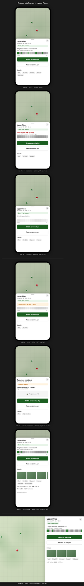

# Proposal: Campsite availability drawer

## Summary

Click a US federal campground pin on the landing-page map and a drawer opens
(mobile bottom sheet, desktop right-side panel) showing 30-day availability as
a heat-strip + plain-English summary. Primary CTA deeplinks to `/campsite` to
create an alert; the drawer itself does not handle alert creation. Backed by a
new public route `GET /api/campsite/availability/{recgov_id}` wrapping the
existing `AvailabilityClient.fetchMonth` with a 10-min TTL cache.

## Motivation

Today the map punts users to recreation.gov to check availability. That breaks
trip-planning flow: `n` rec.gov tabs to compare `n` neighboring campgrounds.
The map already shows spatial context; pulling availability inline turns the
map into a real decision-support surface. Alert management stays at
`/campsite` where the auto-cart companion lives.

Future: this is rec.gov first; state parks, BC/Alberta provincial, Parks
Canada follow as their integrations land. Cache key is provider-scoped from
day 1 so the abstraction layer drops in without rewriting.

## Goals

- Decision support on the map: "is this campground worth alerting on?"
- 30-day window default; 1-tap deeplink to `/campsite` to create an alert
- Mobile-first iPhone Safari; desktop is secondary
- Drawer pattern: bottom sheet (mobile), right-side panel (desktop, 420px)
- All 6 frontend states covered: loading, success, 0-available, closed-for-season, error, empty

## Non-Goals

- Alert creation in the drawer (lives at `/campsite`)
- "Watch nearby campgrounds" cluster-alert
- Multi-provider abstraction in v1 (deferred; cache key is provider-aware)
- SSE live-updates (deferred; events fire only for actively-watched campgrounds)
- Pre-fetch on map-idle (deferred to v2)

## Proposal

### Frontend

- New `web/drawer.js` module. Mobile bottom sheet with two snap states (60% half / 90% full); desktop right-side panel 420px. `100dvh` units + `visualViewport.resize` listener for iOS Safari URL-bar collapse.
- New `web/campground-card.js` extracts shared rendering (amenities, cell, ratings, last_verified) so popup and drawer don't drift.
- `web/popups.js` forks at `openCampgroundPopup`: US federal pins with `recgov_id` AND `?drawer=1` URL flag → drawer; everything else → existing popup.
- 30-cell horizontal heat-strip (`flex: 1` cells, 28px tall, `aria-hidden`); summary sentence carries screen-reader semantics.
- Tap targets 44px (Apple HIG). Tap-outside doesn't dismiss; X-button + drag-past-30% do.
- Pin reselect = opacity fade + skeleton overlay; cancels inflight fetch.

### Backend

- New `GET /api/campsite/availability/{recgov_id}?days=30[&force=1]` returning the locked JSON contract.
- New `CachedAvailability` class wrapping `AvailabilityClient`. Stores `Deferred<Map>` keyed `(provider, campgroundId, month)` so concurrent waiters coalesce. 10-min TTL. Owned `SupervisorJob() + Dispatchers.IO` scope.
- Route validates `recgov_id` regex `^[0-9]{1,10}$`, clamps `days` to 1..60, applies per-IP rate limit (10/min). Computes month list, parallel-fetches via `coroutineScope { async {}.awaitAll() }`.
- 429-exhaustion → `503 {state:"error", error:"rate_limited", retry_after_s}`. Existing `AvailabilityClient` unchanged (poller keeps its semantics).

### JSON contract

```json
{
  "campground_id": "232447",
  "checked_at": "2026-06-05T20:13:00Z",
  "window": {"start": "2026-06-05", "days": 30},
  "summary": "3 nights available · weekends full",
  "state": "success | zero_available | empty | closed_for_season",
  "season": {"reopens_on": "2026-06-15"} | null,
  "availability": [{"date": "...", "status": "available|partial|booked|closed", "available_count": N, "total": N}],
  "cache": {"hit": true, "age_seconds": 120, "ttl_seconds": 600}
}
```

Errors: 400 (`bad_recgov_id`, `bad_days`), 404 (`unknown_campground`), 503 (`rate_limited`, `upstream_5xx`, `ip_throttled`).

### Wireframes



**Figure 1.** Six mobile drawer states (success, 0-available, loading, error, closed-for-season, full-state) + desktop right-side panel. The 0-available state's primary CTA flips to "Snipe a cancellation" — that is the actual snipe use case.

## Rationale

**Why drawer, not popup.** A 320px MapLibre popup can't hold availability + heat-strip + 2 CTAs + photos comfortably. Drawer gives mobile-thumb-reachable layout and lets the user keep map context.

**Why no alert form in drawer.** Alert creation is its own UX (date presets, party size, equipment, auth checks). It belongs at `/campsite`, not duplicated.

**Why drop SSE.** `AvailabilityUpdated` events fire only when the poller is watching a campground. The drawer's value is browsing un-watched pins; SSE doesn't help there. SSE has a future role for cross-feature notifications (Tesla pricing refresh, ATC outcomes) — separate scope.

**Why provider-scoped cache key.** State parks, BC/AB provincial, Parks Canada are real future integrations. `(provider, campgroundId, month)` from day 1 avoids a rewrite later.

**Why `Deferred<Map>` cache.** Concurrent pin clicks on the same uncached campground would otherwise fan out to N rec.gov calls (mutex serializes them, but each new caller still adds 1.5s). `Deferred` coalesces waiters: one fetch, one result.

**Why parallel month fetch.** A 30-day window crosses month boundaries on day 25+. `fetchMonth` is per-month; sequential = ~3s before first byte.

## Unresolved questions

- **Closed-for-season detection:** when does rec.gov return all-`Closed` vs no-data? Need to verify against real campgrounds (Tuolumne Meadows in winter is a likely test case).
- **`/campsite` SPA prefill:** the deeplink `/campsite?campground={recgov_id}` requires the SPA to read the URL param and populate the form. Separate work, not gated on this RFC.
- **ToS exposure:** the public route caches and re-emits rec.gov data. Single-user side project today; if traffic ever scales, revisit `User-Agent` / `Origin` checks and rec.gov's ToS.

## Decision log

| # | Date | Decision | Rationale |
|---|---|---|---|
| 1 | 2026-06-05 | Drawer over popup | 320px popup too cramped for availability + heat-strip + CTAs |
| 2 | 2026-06-05 | Alert creation lives at `/campsite`, drawer deeplinks | Different problem; preset chips + auth + party size are `/campsite`'s domain |
| 3 | 2026-06-05 | Drop SSE live-update from v1 | Events fire only for actively-watched campgrounds; drawer browsing is the un-watched case |
| 4 | 2026-06-05 | Cache key `(provider, campgroundId, month)` from day 1 | Future state-park/Parks Canada/provincial integrations slot in without rewrite |
| 5 | 2026-06-05 | `CachedAvailability` wraps client, doesn't modify it | Poller has different freshness semantics; preserve both paths |
| 6 | 2026-06-05 | `Deferred<Map>` cache, not raw `Map` | Coalesce concurrent waiters; prevent thundering herd from N pin clicks |
| 7 | 2026-06-05 | Parallel month fetch via `awaitAll` | 30-day window crosses month boundaries; sequential is ~3s |
| 8 | 2026-06-05 | URL flag `?drawer=1` (not `?feat=drawer=1`) | `=` in querystring value tokenizes weirdly |
| 9 | 2026-06-05 | Tap-outside doesn't dismiss drawer | Prevents accidental dismissal during map pan |
| 10 | 2026-06-05 | Drag-past-30% dismissal, no velocity threshold | Velocity tracking is gold-plating for v1 |
