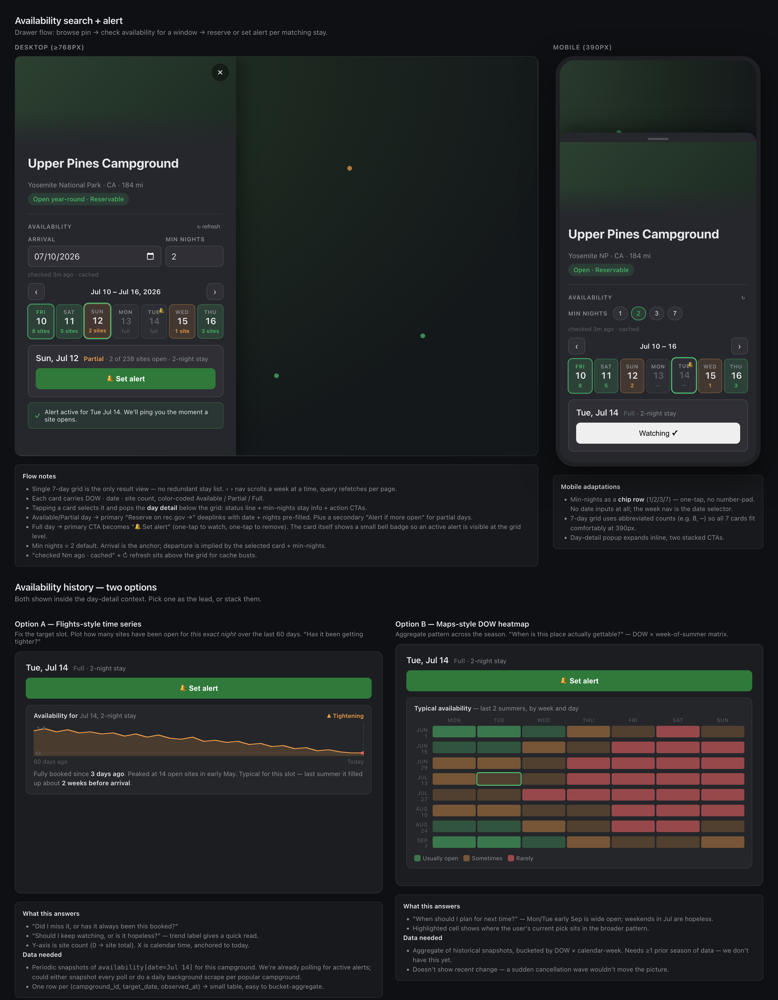

# Proposal: Availability search + per-day alerts (with history spike)

## Summary

Replace the current single-shot 30-day availability strip with a paginated
7-day window grid in the campground drawer. Clicking a day pops a detail panel
whose only action is "🔔 Set alert" — no reserve deeplink. Reserve links stay
at the top-level drawer ("View on rec.gov") so the user can dig into the
upstream UI on their own. Spike historical-availability views (Flights-style
trend, Maps-style DOW heatmap) for a follow-up RFC once we have polling data.

## Motivation

Today's drawer shows a 30-day heat strip starting at "today" and a single
"Watch for openings" button that opens a full alert form. Two problems:

1. **The strip can't move.** Users planning a trip 6 weeks out can see the
   strip is amber/red but have no way to flip forward to the dates they care
   about.
2. **Our availability is more permissive than the booking flow.** We assume
   "any site, tent ok," but rec.gov's calendar enforces site-type / equipment
   filters. A green day in our drawer can be a fully-booked day for the
   user's actual trip. Showing a "Reserve →" button next to that green
   tile implies a guarantee we can't keep.

The fix is a paginated week view (Google-Flights date-grid pattern) that
treats the user's only confident action as "watch this day." Reserve links
become exploratory ("go look at the source"), not actionable.

## Goals

- Browse → check a specific date window → set an alert, all in one drawer, on
  desktop and mobile.
- Make the availability/booking discrepancy invisible by routing every "I
  want this" intent through alerts, not through reserve deeplinks.
- Land the FE+BE work in 2–3 small PRs, each independently shippable.
- Capture history-view designs as a backlog spike — don't block the core
  flow on data we don't have yet.

## Non-Goals

- **Alert management UI.** Listing, pausing, deleting alerts; viewing match
  results. Tracked separately. The drawer creates alerts; it does not list
  them. (We will fetch the user's existing alerts to render 🔔 badges on
  matching days, but that's read-only.)
- **Party-size / equipment filtering.** Min nights is the only filter
  exposed. Defaults assume 2 people + small tent.
- **Historical availability rendering.** Mocked here as a spike for a
  follow-on RFC; not in the initial implementation.
- **Reserve-flow integration.** No auto-cart, no booking-session validation
  in the new UI. The existing `/api/campsite/booking/...` endpoints are
  unchanged.

## Proposal



**Figure 1.** Top: desktop and mobile drawer with the new 7-day grid + day
detail. Bottom: two history options spiked for a future RFC.

### User lifecycle

End-to-end flow, split by which surface owns each step. The campground
drawer is **search and capture intent**; the alerts-management UI (future
work) is **observe and act on what's been polled**.

```
┌─────────────────────────────────────────────────────────────┐
│  CAMPGROUND DRAWER  (this RFC)                              │
│                                                             │
│  1. Browse map → click pin                                  │
│  2. Drawer opens, shows campground info                     │
│  3. Pick min_nights + stay_mode (default 1, any combo)      │
│  4. Page weeks with ‹ ›  (BookingProvider.availability)     │
│  5. See per-day availability for the searched window        │
│                                                             │
│  Branch by intent:                                          │
│    A. "Book it now"  → top-level "View on rec.gov" deeplink │
│       (out of our hands; user reserves on upstream UI)      │
│    B. "Watch it"     → click day → 🔔 Set alert             │
│       POST /api/campsite/alerts                             │
└────────────────────────────┬────────────────────────────────┘
                             │  alert created
                             ▼
┌─────────────────────────────────────────────────────────────┐
│  POLLER  (existing recgov.booker, generalized to ports)     │
│                                                             │
│  Every poll cycle, for each active alert:                   │
│    - registry.forPoi(alert.poi_id) → BookingProvider        │
│    - provider.availability(ref, start, days)                │
│    - AlertEvaluator.evaluate(alert, fresh)                  │
│       (branches on stay_mode: same_site vs any_combination) │
│    - On match: notify + optional AutoBooker.addToCart       │
│    - Append snapshot to availability_snapshots table        │
│      (foundation for history; spike, RFC TBD)               │
└────────────────────────────┬────────────────────────────────┘
                             │  matches + snapshots
                             ▼
┌─────────────────────────────────────────────────────────────┐
│  ALERTS-MANAGEMENT UI  (future work — this RFC defines the  │
│                         data path; UI in a follow-up)       │
│                                                             │
│  - List user's alerts, status, recent matches               │
│  - Pause / resume / delete                                  │
│  - Per-alert detail page:                                   │
│       · history graph (Flights-style trend, from snapshots) │
│       · Slack notification config                           │
│       · auto-cart toggle (gated by                          │
│         capabilities.supportsAutoBook)                      │
└─────────────────────────────────────────────────────────────┘
```

What lives where:

| Step | Surface | Backend touchpoint |
|---|---|---|
| Browse map, open drawer | drawer | `GET /api/pois`, `GET /api/pois/{id}` |
| Search availability | drawer (week grid) | `GET /api/campsite/availability/{poi_id}?start=…&days=7` |
| Book via deeplink | drawer (top-level) | none — user goes to upstream |
| Set alert | drawer (day detail) | `POST /api/campsite/alerts` |
| Poll for openings | poller (background) | `BookingProvider.availability` per alert |
| Match decision | poller | `AlertEvaluator.evaluate` (stay_mode branches) |
| Notify on match | poller | Slack webhook, browser push (future) |
| Auto-add-to-cart | poller | `AutoBooker.addToCart` (capability-gated) |
| Append history snapshot | poller | `availability_snapshots` table (spike) |
| View alert list | alerts UI | `GET /api/campsite/alerts` |
| View per-alert history | alerts UI | `GET /api/campsite/alerts/{id}/history` (future) |
| Pause/delete alert | alerts UI | `PATCH`/`DELETE /api/campsite/alerts/{id}` |

Two things explicitly **not** shown in the drawer:

- **Historical availability trend.** Belongs in the alerts-management UI,
  on the per-alert detail page. The drawer is for capturing intent, not
  for analyzing past data. (Also: history per slot only exists for slots
  someone has alerted on.)
- **Slack config and auto-cart toggle.** Belong in the alerts-management
  UI (and possibly a global settings panel for the Slack webhook itself).
  The drawer's "Set alert" button creates the alert with conservative
  defaults; the user tunes notification settings afterward.

### UX summary

- **7-day grid** replaces the 30-day strip. Each day card carries DOW · date ·
  available-site count, color-coded Available / Partial / Full / Closed.
- **`‹ ›` week nav** above the grid. Each click shifts the visible window by
  7 days and refetches. Within a month, the per-month cache makes this free.
- **Day detail** below the grid when a day is selected: status line +
  min-nights stay info + a single CTA. CTA is always **🔔 Set alert** for the
  user's selected day + min-nights. No reserve link.
- **Alert badges**: a small 🔔 on day cards whose start date matches an
  existing user alert.
- **Min nights** lives next to the week nav. Default = **1**. Desktop =
  small number input; mobile = chip row (1 / 2 / 3 / 7).
- **Stay mode toggle** next to min nights: **same campsite** vs **any
  combination**.
  - *Same campsite* — match a single site that's open for all N consecutive
    nights. Required by rec.gov's reservation flow when the user wants one
    booking.
  - *Any combination* — match if there's at least one site open per night,
    even across different sites. Useful for users (like the author) who
    don't mind a mid-stay site-switch.
  Mode is persisted in localStorage, defaults to *any combination* since
  it's the more permissive and lower-friction option.
- **Top-level "View on rec.gov"** stays in the drawer's action row — neutral
  affordance to the source, no implied availability.

### Backend changes

The endpoints we keep are correct, but the dispatch is implemented in a way
that doesn't scale to a third provider — and we want one. Today we have
RecGov and Aspira; we want Camis (Alberta Parks) and likely ReserveAmerica
next, plus future regional vendors. Before adding `start` and the alert
flow on top of the current code, refactor dispatch into a clean port.

#### Problem with today's dispatch

- `routes/CampsiteAvailabilityRoutes.kt` defines a private sealed
  `ProviderVariant` and parses `provider_ref` JSON into it inline, then
  fans out via `when` to per-provider top-level functions
  (`fetchAndClassifyRecgov`, `fetchAndClassifyAspira`,
  `availableDatesRecgov`, `availableDatesAspira`).
- The alert flow has no equivalent abstraction at all — the recgov poller
  in `ca.floo.campsite.recgov.booker.poller` is hardwired to rec.gov.
- Three duplicate `when` branches today (single-id availability,
  bulk availability, alert poller). Adding Camis means editing all three;
  forgetting one is a silent bug.
- `models.ProviderRef` (sealed class with RecGov/Aspira/Camis) already
  exists — we're just not using it as the dispatch contract.

#### Proposal: one port per booking provider

Introduce a `BookingProvider` interface in `service/booking/` (new
package) with one implementation per upstream. The route, the bulk
endpoint, and the alert poller all consume the interface — they never
`when` on a sealed type.

```kotlin
package ca.floo.roadtrip.service.booking

interface BookingProvider {
    /** Stable id used in provider_ref discrimination + booking_provider FK. */
    val id: BookingProviderId   // RECGOV, ASPIRA_PC, ASPIRA_BC, CAMIS, ...

    /** Per-day availability for a window, provider-stable shape. */
    suspend fun availability(
        ref: ProviderRef,
        start: LocalDate,
        days: Int,
        force: Boolean,
    ): AvailabilityResult

    /** Capability flags — UI hides features the provider doesn't support. */
    val capabilities: BookingCapabilities
}

data class BookingCapabilities(
    /** Can we poll for openings and notify the user? */
    val supportsAlerts: Boolean,
    /** Can we add to cart / book on the user's behalf? */
    val supportsAutoBook: Boolean,
    /** Max days into the future the upstream exposes. */
    val bookingHorizonDays: Int,
)

/** Thrown by adapters when upstream fails; routes map to HTTP error codes. */
sealed class BookingProviderError : Exception() {
    object RateLimited : BookingProviderError()
    object UpstreamUnavailable : BookingProviderError()
    data class Unknown(val cause: Throwable) : BookingProviderError()
}
```

A `BookingProviderRegistry` holds the live adapters, keyed by
`BookingProviderId`. The route asks the registry for the provider that
matches the POI's `provider_ref`; the registry never looks at JSON itself.

```kotlin
class BookingProviderRegistry(private val adapters: Map<BookingProviderId, BookingProvider>) {
    fun forPoi(row: CampsiteProviderRefRow): BookingProvider? = adapters[row.bookingProviderId]
    fun all(): Collection<BookingProvider> = adapters.values
}
```

Route consumption shrinks to:

```kotlin
val provider = registry.forPoi(row) ?: return@get respondEmpty()
val ref = ProviderRef.from(row)  // single shared parser, models layer
val result = provider.availability(ref, start, days, force)
call.respondAvailabilityJson(result.toResponseDto(...))
```

No `when` over `ProviderVariant`, no provider-specific imports in the
route file, no duplicate parsing logic.

The alert path gets its own port for the operations that actually need
provider-specific code:

```kotlin
interface AlertEvaluator {
    /** Given an alert + fresh availability, did anything match? */
    suspend fun evaluate(alert: AlertRow, fresh: AvailabilityResult): List<AlertMatch>
}

interface AutoBooker {
    suspend fun addToCart(ref: ProviderRef, match: AlertMatch, session: BookingSession): BookingAttempt
}
```

Providers that don't support auto-book don't implement `AutoBooker` —
the registry returns null; the FE checks `capabilities.supportsAutoBook`
and hides the auto-cart toggle.

#### File layout

```
service/booking/
├── BookingProvider.kt          # interface, capabilities, errors
├── BookingProviderId.kt        # enum (matches booking_provider FK)
├── BookingProviderRegistry.kt  # DI wiring, lookup by provider_ref
├── ProviderRefParser.kt        # one place that turns JSON → sealed ProviderRef
├── AlertEvaluator.kt           # interface
├── AutoBooker.kt               # interface (optional capability)
└── adapters/
    ├── recgov/
    │   ├── RecGovBookingProvider.kt
    │   ├── RecGovAlertEvaluator.kt
    │   └── RecGovAutoBooker.kt
    ├── aspira/
    │   ├── AspiraBookingProvider.kt
    │   └── AspiraAlertEvaluator.kt
    └── camis/                  # stub adapter, throws Unsupported
        └── CamisBookingProvider.kt
```

Adapters wrap the existing client + cache classes — no behavior change,
just relocation and a uniform interface. The current top-level functions
(`fetchAndClassifyRecgov`, etc.) become private implementation details
of their adapter.

This collapses the three duplicated `when` blocks into one place
(`BookingProviderRegistry.forPoi`) and gives the alert system, the
availability route, and any future endpoint (auto-book, capability probe,
admin tools) a single contract to consume.

#### Endpoints (after refactor)

**Reused unchanged:**

- `GET /api/campsite/availability/{poi_id}?days=N&start=YYYY-MM-DD` —
  single endpoint, dispatches via the registry. The `start` param is the
  one new addition; existing default (`start = today`) is preserved.
- `POST /api/campsite/alerts` — alert creation. Body gains
  `stay_mode: "same_site" | "any_combination"` (default
  `any_combination`). Evaluator branches on this when matching: in
  `same_site` mode, look for one site open across all N nights; in
  `any_combination` mode, succeed if at least one site is open per night
  (allowing site switches mid-stay). Schema-additive; existing alerts
  default to `any_combination` on read.
- `GET /api/campsite/alerts`, `DELETE /api/campsite/alerts/{id}` —
  unchanged.

**New, capability-gated:**

- `GET /api/campsite/capabilities/{poi_id}` — returns
  `BookingCapabilities` for one POI. The FE calls this once per drawer
  open, hides UI affordances the provider doesn't support
  (e.g. auto-book toggle on Camis). Cached client-side per POI.

The 180-day cap on `start` becomes per-provider via
`capabilities.bookingHorizonDays` — no longer hardcoded in the route.

### Frontend changes

- **New module `web/drawer/availability-week.js`** owns: visible week start
  (LocalDate), min nights, selected day, in-flight controller. Renders the
  grid + nav + day-detail panel. Calls
  `requestCampsiteAvailability(poiId, {start, days: 7, signal})`.
- **Update `web/api/availability-api.js`** — the existing
  `requestCampsiteAvailability(id, {days})` gains an optional `start` param.
- **Update `web/drawer/campground.js`** — replace the existing strip block
  and `data-cta="watch"` button with `mountAvailabilityWeek(...)`. Drop the
  full-form alert panel call.
- **Delete `web/drawer/campsite-booking-panel.js`** — no current users of
  the full form once the day-detail flow ships. Alert filters (campsite
  types, equipment, party size) move to the future alert-management UI,
  where they belong.
- **Day-click → alert** uses `createCampsiteAlert(payload)` directly with
  defaults (no auto-cart, `stop_after_match: true`, empty filters). On
  success, the day cell flips to a 🔔-badged "Watching ✓" state. Click again
  → `DELETE /api/campsite/alerts/{id}`.

### Rollout

| PR | Scope | Risk |
|---|---|---|
| 1 | BE: extract `BookingProvider` port + adapters for RecGov and Aspira; route consumes registry instead of inline `when`. No behavior change. | Medium — pure refactor, but touches three call sites; covered by existing IT tests |
| 2 | BE: stub `CamisBookingProvider` (throws Unsupported); add `start` query param; add `GET /api/campsite/capabilities/{poi_id}` | Low — additive |
| 3 | FE: `availability-week.js`, refactor `campground.js`, drop the booking panel | Medium — replaces visible UI; manual QA gates |
| 4 | FE polish: alert badges via `GET /api/campsite/alerts`; capability gating; min-nights / mode persistence | Low — read-only enrichment |

PR 1 is the abstraction work. Landing it before any new feature means PRs
2–4 (and every future provider) only touch the adapter directory, not the
route. That's the test of whether the abstraction is right: when Camis
ships for real, no file outside `service/booking/adapters/camis/` should
need to change.

### Polling lifecycle

The poller is **alert-driven**, not driven by a global "popular
campgrounds" list. The unit of polling is a `(poi_id, target_date)`
tuple, not an alert id. This dedups across users (Alice and Bob both
alerting on Upper Pines Jul 14 → one upstream call, two notifications)
and bounds upstream load to slots someone actually cares about.

| Event | Effect on `availability_polls` |
|---|---|
| First alert covering `(poi_id, d)` created | Insert row, `active_alert_count = 1`, `next_poll_at = now()` (immediate first poll). |
| Additional alert on same `(poi_id, d)` | Increment `active_alert_count`. No extra polling. |
| Alert paused / deleted | Decrement `active_alert_count` for each slot it covered. Where the count hits 0, delete the row — polling stops. |
| Target date elapsed (`target_date < today`) | Daily sweep: delete rows, mark fully-elapsed alerts `status='done'`. |
| Poll succeeds | `last_polled_at = now()`, `next_poll_at = now() + cadence`, reset failures. |
| Poll fails (rate limit / 5xx) | Increment failures, exponential backoff on `next_poll_at`. |

Polling stops naturally when the user turns the monitor off or the date
elapses. Both routes go through the same lifecycle table; no separate
cleanup path.

An alert covers multiple slots: a 3-night alert on Jul 14 holds Jul 14,
15, 16. The poll table gets one row per slot; the user's alert is the
join key (`alerts.id` ↔ `(poi_id, target_date)`).

### History data model

Two tables: one drives polling, one captures observations.

```sql
-- Driven by active alerts. One row per slot we're actively watching.
CREATE TABLE availability_polls (
  poi_id              BIGINT      NOT NULL,
  target_date         DATE        NOT NULL,
  active_alert_count  INT         NOT NULL,
  first_alerted_at    TIMESTAMPTZ NOT NULL,
  last_polled_at      TIMESTAMPTZ,
  next_poll_at        TIMESTAMPTZ NOT NULL,
  consecutive_failures INT        NOT NULL DEFAULT 0,
  PRIMARY KEY (poi_id, target_date)
);

-- Append-only. One row per successful poll per target_date observed.
CREATE TABLE availability_snapshots (
  poi_id          BIGINT      NOT NULL,
  target_date     DATE        NOT NULL,
  observed_at     TIMESTAMPTZ NOT NULL,
  available_count SMALLINT    NOT NULL,
  total           SMALLINT    NOT NULL,
  status          TEXT        NOT NULL, -- 'available' | 'partial' | 'booked' | 'closed'
  PRIMARY KEY (poi_id, target_date, observed_at)
);
CREATE INDEX ON availability_snapshots (poi_id, observed_at); -- for pruning
```

**Cheap data widening:** when we poll a campground, the upstream returns
a whole month of per-day availability. Even if only Jul 14 is alerted,
we snapshot every day in the returned month. Same upstream call, ~30×
more history. Future alerts on a recently-polled campground get instant
history.

### Query shapes

**Per-slot trend** (Flights-style graph — the lead history view):

```sql
SELECT observed_at, available_count, total, status
FROM availability_snapshots
WHERE poi_id = ?
  AND target_date = ?
  AND observed_at >= now() - interval '60 days'
ORDER BY observed_at;
```

Hits the primary-key prefix `(poi_id, target_date, *)` — index-only scan.

**Per-campground typical pattern** (Maps-style heatmap):

```sql
SELECT DISTINCT ON (target_date)
       target_date, available_count, total
FROM availability_snapshots
WHERE poi_id = ? AND target_date BETWEEN ? AND ?
ORDER BY target_date, observed_at DESC;
```

App layer buckets by DOW × week-of-season. Cold-start until ≥1 prior
season exists; not a v1 view.

**API:**

```
GET /api/campsite/availability/{poi_id}/history
  ?target_date=YYYY-MM-DD&days=60
→ [{observed_at, available_count, total, status}, ...]
```

Capability-gated by `supportsAlerts` — providers that don't poll have no
snapshots to return; this endpoint 404s.

### Poll cadence

Cadence is **configurable**, not hardcoded. The poller reads cadence
from a layered config: a global default, optional per-campground
override, optional per-alert override. Each layer falls through.

```
effective_cadence = alert.cadence_override
                 ?? campground.cadence_override
                 ?? global.default_cadence
```

**v1 (this RFC):** ship the global default only — one value
(`POLLER_DEFAULT_CADENCE_MIN`, default `15`) read from env. The lookup
chain exists in code (`PollCadenceResolver`) so per-campground and
per-alert overrides can be added later without touching call sites,
but the override columns are not surfaced in any UI yet.

**Future work (deferred):**

- **Per-campground override** column on a `campground_poll_config`
  table or as a JSONB sidecar on `pois`. High-demand sites
  (Upper Pines in Yosemite, Glacier Point, etc.) warrant tighter
  cadence — minutes, not quarter-hours — because cancellations get
  re-snapped within seconds.
- **Per-alert override** column on `alerts`. Power users may want to
  poll their watched slot harder than the campground default.
- **Admin UI** to set both. Until then, overrides are DB-only.

**Rate-limit interaction:** cadence is a *target*, not a guarantee.
The adapter's existing rate limiter (`IpRateLimiter` for rec.gov, the
Aspira equivalent) and the per-slot `consecutive_failures` exponential
backoff both override the configured cadence whenever upstream pushes
back. The resolver decides "when *would* we like to poll next"; the
poller's outer loop reconciles that against actual upstream health.

This is a known spike: cadence semantics will get more nuanced as we
learn what high-demand campgrounds actually need. Capture the layered-
config shape now so the call sites are right; tune the values later.

### Retention

100 active slots × 15-minute cadence ≈ 9,600 rows/day. Fine short-term;
needs downsampling.

- **0–90 days:** raw, full resolution.
- **90 days – 1 year:** daily aggregates (`min/avg/max(available_count)`,
  `total`, dominant `status`). Generated by a daily cron.
- **>1 year:** keep aggregate, drop raw.

The trend graph reads raw within 60 days, aggregates beyond. The heatmap
reads aggregates only (daily resolution is sufficient).

### Spike for future RFC: surfacing history

The data model above ships with the alert system (PR 1–4). The history
*views* — Flights-style trend in the alert detail page, Maps-style
heatmap as a typical-pattern overlay — are deferred to a follow-up RFC
once we've accumulated polling data. The mock includes both options as
design references; neither is built in this RFC's scope.

The trend graph is recommended as the lead view for that follow-up: it
answers the in-context question ("did I miss it, or has it always been
this booked?") and starts producing useful results within ~7 days of
polling. The heatmap is cold-start unfriendly and answers a planning
question that comes earlier in the funnel.

## Rationale

**Why a `BookingProvider` port now, not when Camis actually ships?**
Today's code has three parallel `when (variant: ProviderVariant)` blocks
(single-id availability, bulk availability, alert poller) and a private
`ProviderVariant` sealed type that duplicates `models.ProviderRef`.
Adding Camis means editing all three places, plus parsing
`provider_ref` JSON in a fourth place, plus growing the alert poller
which currently hardcodes `recgov.booker`. Each addition deepens the
duplication. The refactor replaces three switches with one registry and
gives the alert system a contract it can poll generically. It costs one
PR of churn now to avoid a multiplying tax forever.

**Why split `BookingProvider` / `AlertEvaluator` / `AutoBooker` into
three interfaces, not one?**
Capability surface differs per provider. Every provider that returns
availability (`BookingProvider`) can also be polled
(`AlertEvaluator` is mechanical given availability data). Auto-book is
the genuinely optional one — it requires session management, anti-bot
handling, and per-vendor cart APIs. Camis may never get auto-book.
Modeling it as a separate interface lets the registry return null and
the FE hide the UI; modeling it as a method on `BookingProvider`
forces every adapter to implement an `UnsupportedOperationException`
stub, which is the same anti-pattern as a god interface.


**Why drop reserve deeplinks from the day detail?**
Our availability data is permissive (any site, no equipment filter). The
booking flow is restrictive (user's specific equipment, party size, and
site-type constraints). A green tile in our drawer is not the same thing as
a bookable site for that user. Putting a primary "Reserve →" button next to
that tile implies a contract we can't enforce. Routing intent through
alerts removes the mismatch — the alert poller validates against the user's
actual filters before notifying. The top-level "View on rec.gov" button
stays as a generic source link; it makes no claim about availability.

**Why 7 days, not 14 / 30?**

- Mobile width caps the grid at ~7 cells before per-cell info gets unreadable.
- Pages of 7 align with weekend planning ("can I get this Sat-Sun?").
- The per-month cache makes paging free within a month, so the visible-window
  size is purely a UI concern.

**Why one CTA, not two ("Set alert" + "Open in rec.gov")?**
Tested in the mock; the second CTA in day detail clutters the panel and
duplicates the top-level rec.gov button. Decided to keep the day detail
focused on the single confident action.

**Why kill the full alert form?**
Alert filters (campsite types, equipment, party size) belong in an
alert-management UI, where the user is editing an existing alert and has
context. Forcing the user to fill them in before any alert exists is the
wrong order — most users want a quick "watch this day," and we can prompt
for filters later when a match arrives or when they manage the alert list.

## Deferred: reservable hierarchy

A redesign that surfaced during PR #199 review and is captured here so
future-us doesn't re-derive it. **Not in scope for this RFC.** Tracking
to a follow-up RFC once we have a second reservable type to validate the
shape against.

### What prompted it

The current model treats "campground" as the addressable unit and
"site" as a child of campground. Walking that through three providers,
plus thinking about non-campground reservables, the model strains:

| Concept | Recgov | Aspira | Camis |
|---|---|---|---|
| Bookable unit | `campsite_id` | `resourceId` | `siteId` |
| Group of units (often a loop) | `loop` (string field) | mapLink (sub-area) | loop |
| Bookable destination | `facility_id` | `mapId` (+ `transactionLocationId`) | `facilityId` |
| Geographic park | `RECAREA` (optional) | `transactionLocationId` (sometimes distinct) | (none) |

Important data finding: **Aspira's `/api/availability/map` response
includes `resourceAvailabilities` — per-individual-site availability
data we currently discard.** Today our cache stores only the rolled-up
`mapAvailabilities` and `byMapLink` (sub-area). The per-resource
availability is in the same upstream call we already make.

So per-site granularity is achievable across all three providers; the
current model just hasn't pulled it through. That makes the case for a
hierarchy-aware redesign concrete rather than speculative.

### Beyond campsites

The roadmap mentions monitoring + alerting + auto-cart for things that
aren't campsites:

- frontcountry campground sites
- backcountry permit zones (Half Dome, Mt Whitney)
- day-use parking permits
- timed-entry tickets (Arches, Glacier)
- group sites, lottery permits

A `/campground/{id}/site/{id}` URL doesn't fit a Half Dome permit
(permit isn't *in* a campground) or an Arches timed-entry ticket
(ticket isn't tied to a site). The right abstraction is one level up:
**reservable** — a thing-you-can-hold-at-a-place. Campsites, permits,
and tickets are all *types* of reservable.

### Proposed shape (not yet committed)

```
POI (map pin)                ← what the user clicks. Already exists.
  └── Reservable (×N)        ← new abstraction. type + vendor + vendor_id. Bookable.
```

A POI is a place. A reservable is a thing-you-book at that place. A
campground POI has many `site:*` reservables. A trailhead POI might
have one `permit:recgov:445859` reservable for Half Dome. An Arches
entrance POI has a stream of `ticket:nps:...` reservables (one per
slot per day).

Composite reservable id, on the wire as `{type}:{vendor}:{vendor_id}`:

```
site:recgov:330257             # one campsite at Lower Pines
site:aspira:-2147483190        # one resource at a BC park
permit:recgov:445859           # Half Dome permit slot
ticket:nps:arches-2026-08-01-09:00   # Arches timed entry, specific slot
```

Vendor and type are closed enums in the BE (sealed types). Vendor IDs
stay opaque. URL-safe. The reservable type drives response shape
(sites have `loop`; permits have `zone`; tickets have `time_slot`),
upstream deeplink format, alert payload shape, and auto-book flow.

URL pattern after this pivot:

```
GET /api/reservable/{rid}                       info: name, vendor, type, parent POI, capabilities
GET /api/reservable/{rid}/availability          per-time-unit status (day, hour, slot)

GET /api/poi/{poi_id}/reservables               list child reservables
GET /api/poi/{poi_id}/reservables/availability  per-day rollup across children
```

### Why deferred

- **No second reservable type built yet.** Doing the abstraction now
  with only campsites means guessing at the shape for permits and
  tickets. Once we plumb a permit through (likely Half Dome — fits the
  alert-driven monitoring model cleanly), the abstraction's edges
  reveal themselves and the design firms up.
- **The current `BookingProvider` port (PR #198) is the right seam.**
  Generalizing it to `(vendor, reservable_type) → adapter` is additive,
  not a rewrite.
- **Alert + poll tables would migrate.** `availability_polls` would
  rekey from `(poi_id, target_date)` to `(reservable_id, target_date)`.
  Existing alerts get rewritten to `site:recgov:{recgov_id}`. Doable,
  but a real migration; doing it once with the second use case in
  hand is cheaper than doing it twice.

### What this means for the v1 work in this RFC

PR #198 (BookingProvider port) and PR #199 (week grid + per-day alerts)
ship as planned. Both decisions made were **forward-compatible** with
the reservable redesign:

- The `BookingProvider` port is per-vendor, not per-reservable-type —
  reservable type slots in as a second registry dimension later.
- The `availability_polls` slot model (`(poi_id, target_date)`) maps
  cleanly to `(reservable_id, target_date)` once reservable exists.
- The alert payload's `campground_id` field becomes `reservable_id`
  later; existing alerts migrate via a one-shot SQL rewrite.

The follow-up RFC will define the reservable schema, composite-id
parser, type taxonomy, and migration plan. Until then, the v1 model
(campground + site, both keyed by POI id) is the right first cut.

## Unresolved questions

- **Alert dedup.** Two clicks on the same day shouldn't create two alerts.
  Plan: pre-fetch `GET /api/campsite/alerts`, match on `(campground_id,
  start_date, min_nights)` before creating. Confirm this matches the
  poller's expectations.
- **Default min_nights = 1.** Most road-trip users want a one-night stop.
  Multi-night users override; persist last value per user in localStorage.
- **Stay-mode evaluation cost.** `same_site` matching is more expensive
  on the alert poller side — needs per-site per-night intersection across
  the window. Acceptable for now since alert volume is low; revisit if
  poll latency degrades.
- **What happens at the season boundary?** Paging the week nav into a
  closed-for-season window. Show all 7 cards as "Closed" with a small
  inline note ("Reopens MMM DD") — same data the existing strip already
  returns in `state: closed_for_season`.
- **Alerts management entry point.** Where in the UI does the user reach
  the management screen? Topbar? Map control? Out of scope for this RFC,
  but the answer affects how prominently we badge alert state on the
  drawer.
